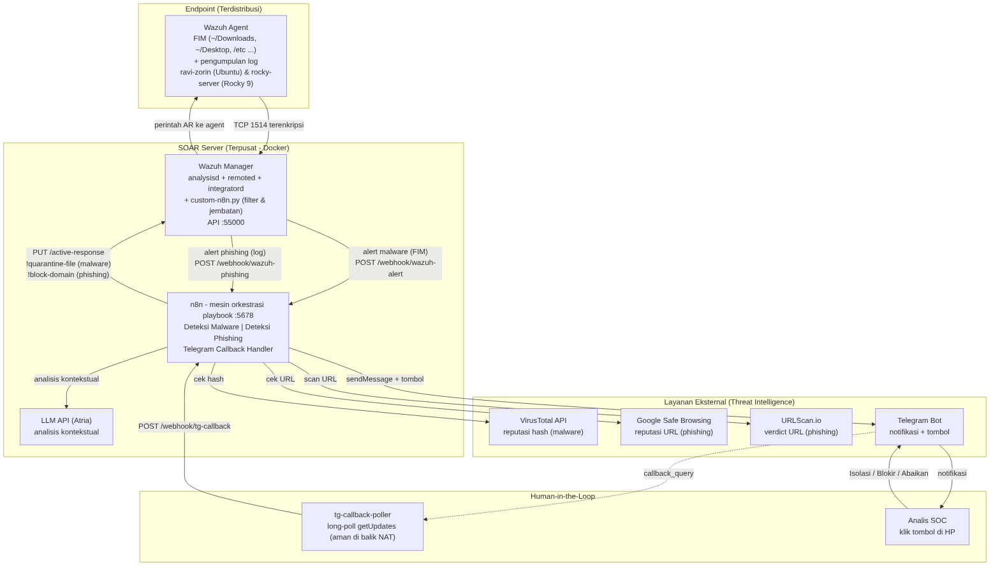

<div align="center">

# SOAR Open-Source (n8n + Wazuh + AI Lokal)

**Implementasi Sistem SOAR Open-Source Berbasis n8n untuk Deteksi dan Respons Ancaman Malware dan Phishing dengan Mitigasi Aktif Human-in-the-Loop**

[](#)
[](#lisensi)
[](https://wazuh.com)
[](https://n8n.io)
[](https://ollama.com)
[](https://www.docker.com)
[](https://www.python.org)
[](https://core.telegram.org/bots/api)

Threat intelligence multi-sumber, respons berjenjang berbasis keyakinan, analisis AI on-premise, dan approval analis lewat satu klik di Telegram.

</div>

---

## Sorotan

- **SOAR penuh dari komponen open-source**, setara kapabilitas Cortex XSOAR atau Splunk SOAR tanpa biaya lisensi.
- **Respons berjenjang (confidence-based):** sistem yakin akan bertindak otomatis, sistem ragu akan menyerahkan keputusan ke analis (human-in-the-loop).
- **Threat intelligence multi-sumber:** VirusTotal, Google Safe Browsing, dan URLScan.io, sehingga beban terbagi, tahan rate-limit, dan akurasi konsensus.
- **AI analysis on-premise** (Ollama llama3.2), data sensitif tidak keluar infrastruktur dan tanpa biaya API.
- **Active Response nyata:** karantina file malware dan sinkhole domain phishing di endpoint, dapat di-rollback.
- **Lintas distribusi dan resilient:** multi-agent (Ubuntu dan Rocky Linux) via mesh VPN Tailscale.

---

## Stack Teknologi

| Komponen | Peran | Versi |
|----------|-------|-------|
| **Wazuh Manager** | SIEM, korelasi aturan, integratord, Active Response | 4.9.2 |
| **Wazuh Indexer** | OpenSearch, penyimpanan dan pencarian log | 4.9.2 |
| **Wazuh Dashboard** | Antarmuka monitoring (opsional) | 4.9.2 |
| **Wazuh Agent** | FIM dan monitoring endpoint | 4.9.2 |
| **n8n** | Mesin orkestrasi playbook (otak SOAR) | latest |
| **Ollama** | Inferensi LLM lokal (`llama3.2:3b`) | latest |
| **VirusTotal API** | Reputasi hash file (60+ antivirus) | v3 |
| **Google Safe Browsing** | Reputasi URL phishing (mesin di balik Chrome) | v4 |
| **URLScan.io** | Analisis dan verdict URL | v1 |
| **Telegram Bot** | Kanal notifikasi dan antarmuka keputusan dua arah | - |

---

## Arsitektur



Diagram lengkap dan penjelasan awam: [`docs/ARCHITECTURE.md`](docs/ARCHITECTURE.md), [`docs/FLOW.md`](docs/FLOW.md), [`docs/PANDUAN-DIAGRAM.md`](docs/PANDUAN-DIAGRAM.md).

---

## Kapabilitas Deteksi dan Respons

### Malware (berbasis VirusTotal, bukan kebisingan FIM)

Wazuh FIM memantau filesystem; setiap file diperiksa ke VirusTotal, dan keputusan mengikuti verdict VirusTotal, bukan sekadar "ada file baru".

| Hasil VirusTotal | Severity | Tindakan |
|------------------|----------|----------|
| `malicious >= 20` | KRITIS | Auto-karantina file dan notifikasi |
| `malicious 1-19` | TINGGI | Tombol Telegram, analis memutuskan |
| `malicious = 0` (bersih atau tak dikenal) | Aman | Disenyapkan (tanpa false positive) |

Filter noise pra-scan (temp browser, unduhan separuh, hash kosong), cache verdict per-hash, dan rate-limit (429) tidak dianggap bersih.

### Phishing (berbasis Google Safe Browsing dan URLScan.io)

| Hasil sumber | Severity | Tindakan |
|--------------|----------|----------|
| GSB atau URLScan terdeteksi jahat | BERBAHAYA | Auto-sinkhole domain (`0.0.0.0` di `/etc/hosts`) |
| Skor mencurigakan | MENCURIGAKAN | Tombol Telegram, analis memutuskan |
| Sumber tak bisa verifikasi (rate-limit) | PERLU VERIFIKASI | Eskalasi ke analis (tidak diklaim aman) |
| Bersih | AMAN | Tidak ada aksi |

VirusTotal digeser jadi eskalasi, cache per-URL, dan short-circuit (GSB threat memicu blokir cepat).

---

## Quick Start

```bash
# 1. Jalankan server (laptop utama)
cd ~/Projects/soar-project
docker compose up -d                                   # n8n + tg-callback-poller
cd wazuh-docker/single-node && docker compose up -d    # Wazuh stack
cd ../..

# 2. Jalankan agent (host atau endpoint)
sudo systemctl start wazuh-agent

# 3. Hangatkan AI lokal (inferensi pertama lebih cepat)
ollama run llama3.2:3b "test" >/dev/null

# 4. Uji pipeline malware (EICAR), notifikasi Telegram dalam 15-30 dtk
printf '%s' 'X5O!P%@AP[4\PZX54(P^)7CC)7}$EICAR-STANDARD-ANTIVIRUS-TEST-FILE!$H+H*' \
  > ~/Downloads/eicar-test.com

# 5. Uji pipeline phishing
bash scripts/test-phishing.sh "https://www.google.com/"     # hasil: AMAN
```

> **Konfigurasi:** simpan API key di `.env` (`GSB_API_KEY`, `URLSCAN_API_KEY`) lalu daftarkan sebagai credential di n8n.
>
> **Active Response phishing:** jalankan `sudo bash scripts/deploy-block-domain.sh` (sekali) untuk memasang AR sinkhole domain.

---

## Struktur Repositori

```
soar-project/
├── docker-compose.yml                  # n8n + tg-callback-poller
├── wazuh-docker/single-node/           # Wazuh manager, indexer, dashboard
├── n8n-workflows/
│   ├── deteksi-malware.json            # Pipeline malware (VT-gated, cache, tiering)
│   ├── deteksi-phishing.json           # Pipeline phishing (GSB + URLScan + sinkhole)
│   └── telegram-callback-handler.json  # Handler tombol (karantina dan blokir)
├── scripts/
│   ├── custom-n8n.py                   # Jembatan integratord Wazuh ke webhook n8n
│   ├── quarantine-file                 # AR: karantina file malware
│   ├── block-domain                    # AR: sinkhole domain phishing (plus rollback)
│   ├── deploy-block-domain.sh          # Deploy AR sinkhole ke agent dan manager
│   ├── tg-callback-poller.py           # Long-poll Telegram ke n8n (anti-NAT)
│   ├── phishing-rule.xml               # Custom rule Wazuh (phishing)
│   └── *.sh / *.xml                    # Konfigurasi FIM, apply scripts, dll.
└── docs/
    ├── ARCHITECTURE.md, FLOW.md, DEPLOYMENT.md
    ├── KARTU-DEMO.md                   # Kartu contekan demo
    ├── PANDUAN-DIAGRAM.md              # Panduan baca diagram (awam)
    └── Laporan-SOAR.md                 # Laporan Tugas Akhir
```

---

## Endpoint

| Layanan | URL |
|---------|-----|
| n8n editor | `http://localhost:5678` |
| Webhook malware | `http://localhost:5678/webhook/wazuh-alert` |
| Webhook phishing | `http://localhost:5678/webhook/wazuh-phishing` |
| Webhook callback Telegram | `http://localhost:5678/webhook/tg-callback` |
| Wazuh Dashboard | `https://localhost:443` |
| Wazuh API | `https://localhost:55000` |
| Wazuh Indexer | `https://localhost:9200` |

---

## Multi-Agent

```
ID 000  wazuh.manager   (server)
ID 001  ravi-zorin      (Ubuntu/Debian, laptop utama)
ID 002  rocky-server    (Rocky Linux 9, ThinkPad X260)
```

Antar-host terhubung lewat **Tailscale** (mesh VPN) sehingga agent tetap melapor walau beda jaringan.

---

## Keamanan

- Secret (API key, token, password) tidak pernah hardcoded; disimpan di `.env` (gitignored) dan credential n8n terenkripsi.
- `backups/` berisi snapshot lokal dan diabaikan git (jangan di-commit).
- Active Response untuk kasus ambigu memerlukan persetujuan analis (human-in-the-loop) agar tidak terjadi isolasi atau blokir buta.

---

## Lisensi

Proyek akademik open-source. Tiap komponen tunduk pada lisensinya masing-masing: **Wazuh** (GPLv2), **n8n** (Sustainable Use License), **Ollama** (MIT).

<div align="center">

Dibuat untuk Tugas Akhir oleh **Ravi Arnan Irianto**, Teknologi Informasi, Universitas Udayana.

</div>
