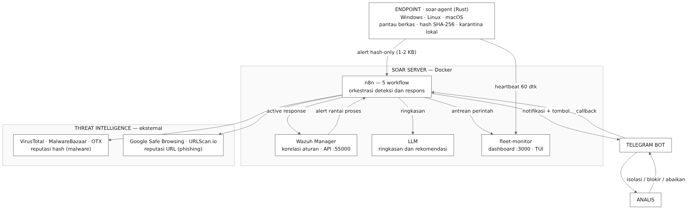

<div align="center">

# SOAR Open-Source (Wazuh + n8n + HITL)

**Implementasi Sistem SOAR Open-Source Berbasis n8n untuk Deteksi dan Respons Ancaman Malware dan Phishing dengan Mitigasi Aktif Human-in-the-Loop**

[](#)
[](https://wazuh.com)
[](https://n8n.io)
[](agent-rs/)
[](https://www.docker.com)
[](https://www.python.org)
[](https://core.telegram.org/bots/api)

Threat intelligence multi-sumber, respons berjenjang berbasis keyakinan, ringkasan AI, dan approval analis lewat satu klik di Telegram.

</div>

---

## Sorotan

- **SOAR penuh dari komponen open-source** — setara kapabilitas Cortex XSOAR atau Splunk SOAR tanpa biaya lisensi.
- **Respons berjenjang (confidence-based)** — sistem yakin bertindak otomatis; sistem ragu menyerahkan keputusan ke analis (human-in-the-loop).
- **Threat intelligence multi-sumber** — VirusTotal + MalwareBazaar (ensemble malware), GSB + URLScan.io (phishing), AlienVault OTX sebagai fallback saat rate-limit.
- **Hemat kuota & anti-noise** — filter noise pra-scan, cache verdict berbasis hash dengan TTL diferensial, dan dedup claim-check di sisi server.
- **Agen ringan lintas OS** — `soar-agent` (Rust, ~5 MB) untuk Linux, Windows, dan macOS; mengirim metadata + hash saja, isi berkas tidak pernah keluar endpoint.
- **Bukti yang bisa dipantau** — dashboard web (UI bergaya Wazuh), TUI terminal, dan API monitoring dengan heartbeat 60 detik.
- **Setup lintas-device** — bootstrap server satu perintah + empat jalur pemasangan agent, termasuk rollout fleet via Ansible.

---

## Arsitektur



Empat kelompok komponen:

| Kelompok | Isi |
|----------|-----|
| **Endpoint** | `soar-agent` (Rust) — FIM (`~/Downloads`, `~/Desktop`, USB), hash SHA-256, karantina lokal. Kompatibel dengan Wazuh Agent untuk aturan rantai proses. |
| **SOAR Server** | Wazuh Manager (korelasi aturan + Active Response + API `:55000`), n8n (orkestrasi, 5 workflow), LLM (ringkasan/rekomendasi), `fleet-monitor` + dashboard. |
| **Threat Intelligence** | VirusTotal, MalwareBazaar, AlienVault OTX (hash); Google Safe Browsing, URLScan.io (URL). |
| **Human-in-the-Loop** | Telegram Bot (notifikasi + tombol keputusan) dan Analis SOC. |

Penjelasan awam dan diagram lain: [`docs/ARCHITECTURE.md`](docs/ARCHITECTURE.md), [`docs/FLOW.md`](docs/FLOW.md), [`docs/PANDUAN-DIAGRAM.md`](docs/PANDUAN-DIAGRAM.md).

---

## Alur Singkat

1. **Endpoint** — berkas baru terdeteksi; agent menghitung SHA-256 dan mengirim alert ringan (1-2 KB) ke webhook n8n. Isi berkas tidak dikirim.
2. **n8n** — menyaring noise, lalu memeriksa verdict: cache hash → VirusTotal → MalwareBazaar (bila perlu) → OTX bila VT rate-limit.
3. **Klasifikasi** — severity ditentukan dari jumlah deteksi dan level rule Wazuh, bukan sekadar "ada berkas baru".
4. **Respons** — kasus berkeyakinan tinggi dieksekusi otomatis; kasus ambigu memunculkan tombol keputusan di Telegram.
5. **Jejak** — setiap event masuk `fleet-monitor` dan tampil di dashboard (status, severity, hash, tautan VirusTotal).

---

## Stack Teknologi

| Komponen | Peran | Versi |
|----------|-------|-------|
| **Wazuh Manager** | SIEM, korelasi aturan, integratord, Active Response | 4.10.5 |
| **Wazuh Indexer** | OpenSearch, penyimpanan dan pencarian log | 4.10.5 |
| **Wazuh Dashboard** | Antarmuka bawaan Wazuh (opsional) | 4.10.5 |
| **n8n** | Mesin orkestrasi playbook (otak SOAR) | 2.40.0 |
| **soar-agent** | Agen endpoint Rust: FIM, hash, karantina, scan on-demand | - |
| **fleet-monitor** | API monitoring (heartbeat, event, command queue, cache verdict) | stdlib Python |
| **dashboard** | UI monitoring (gaya Wazuh) | Next.js |
| **VirusTotal API** | Reputasi hash (70+ antivirus) | v3 |
| **MalwareBazaar API** | Sumber intel kedua untuk malware | v1 |
| **AlienVault OTX** | Fallback saat VirusTotal rate-limit | v1 |
| **Google Safe Browsing** | Reputasi URL phishing | v4 |
| **URLScan.io** | Analisis dan verdict URL | v1 |
| **LLM** | Ringkasan dan rekomendasi Bahasa Indonesia (provider dapat ditukar) | - |
| **Telegram Bot** | Kanal notifikasi dan antarmuka keputusan dua arah | - |

---

## Kapabilitas Deteksi dan Respons

### Malware (berbasis reputasi hash)

Agent memantau filesystem; setiap hash diperiksa ke sumber intel, dan keputusan mengikuti verdict — bukan sekadar "ada berkas baru".

| Verdict | Severity | Tindakan |
|---------|----------|----------|
| Deteksi tinggi (`malicious >= 20`) atau rule level >= 12 | **KRITIS** | Karantina otomatis + notifikasi |
| Terdeteksi sedang (`malicious >= 5`), atau dikenali MalwareBazaar/OTX | **TINGGI** | Tombol Telegram, analis memutuskan |
| Bersih / tak dikenal tanpa sinyal lain (rule level rendah) | SEDANG | Disenyapkan (tanpa false positive) |

### Phishing (berbasis reputasi URL)

| Verdict | Severity | Tindakan |
|---------|----------|----------|
| GSB atau URLScan mendeteksi jahat | **BERBAHAYA** | Auto-sinkhole domain (`0.0.0.0` di `/etc/hosts`) |
| Skor mencurigakan | MENCURIGAKAN | Tombol Telegram, analis memutuskan |
| Sumber tak bisa diverifikasi (rate-limit/error) | PERLU VERIFIKASI | Eskalasi ke analis — tidak diklaim aman |
| Bersih | AMAN | Tidak ada aksi |

### Lapisan penghemat kuota dan anti-noise

- **Filter noise pra-scan** — berkas sementara (`*.part`, `*.crdownload`), berkas 0-byte, dan event `deleted` akibat karantina tidak diproses.
- **Cache verdict per hash** — TTL diferensial: **malicious 7 hari**, **bersih 24 jam**, **tidak dikenal 6 jam** (verdict bersih cepat di-refresh agar deteksi tidak basi). Cache berbasis hash, sehingga burst 100 PC dengan malware sama hanya memanggil VirusTotal sekali.
- **Dedup claim-check** — alert identik dalam 5 menit tidak diproses dua kali (fail-open: dedup rusak tidak boleh mematikan deteksi).
- **Fallback bertingkat** — 429/error VirusTotal dialihkan ke OTX; deteksi tinggi tetap dinaikkan.

---

## Quick Start

```bash
# 1. Server — bootstrap satu perintah (idempoten: .env, sertifikat Wazuh,
#    compose up, integrasi, sinkron credential + workflow n8n)
bash deploy/setup-server.sh

# 2. Workstation — pilih salah satu jalur
sudo apt install ./soar-agent_0.1.0_amd64.deb              # Linux, via .deb
sudo AGENT_ID=004 AGENT_NAME=laptop-budi bash deploy/agent-install.sh
ansible-playbook -i deploy/ansible/inventory-agents.ini \
  deploy/ansible/deploy-agents.yml                          # rollout fleet
powershell -File deploy/install-agent-windows.ps1           # Windows

#    Inventory Ansible: salin `deploy/ansible/inventory-agents.ini.example`
#    lalu isi daftar host dan agent_id-nya.

# 3. Verifikasi pipeline malware (EICAR) — notifikasi Telegram dalam 15-30 detik
printf '%s' 'X5O!P%@AP[4\PZX54(P^)7CC)7}$EICAR-STANDARD-ANTIVIRUS-TEST-FILE!$H+H*' \
  > ~/Downloads/eicar-test.com

# 4. Verifikasi pipeline phishing
bash scripts/test-phishing.sh "https://www.google.com/"      # hasil: AMAN
```

> **Konfigurasi:** salin `.env.example` ke `.env` dan isi API key; `deploy/n8n-setup.py`
> mendaftarkannya sebagai credential n8n (ID credential di-remap by name, jadi tidak ada
> node merah setelah import).
>
> **Active Response phishing:** `sudo bash scripts/deploy-block-domain.sh` (sekali).

---

## Monitoring

| Cara | Alamat | Catatan |
|------|--------|---------|
| Dashboard web | `http://<server>:3000` | GUI utama (UI bergaya Wazuh): status agent, severity, event, detail agent |
| API monitoring | `http://<server>:8080` | `/api/fleet`, `/api/events`, `/api/scan-results`, `/api/vt-cache` |
| TUI terminal | `python3 scripts/fleet-tui.py` | Kembaran dashboard untuk sesi SSH (stdlib curses) |

Fleet saat ini (bertambah sampai 100 workstation):

| ID | Host | OS |
|----|------|-----|
| 000 | wazuh.manager | Server (manager) |
| 001 | ideapc | Windows |
| 002 | bali-handmade | Windows |
| 003 | toshiba-bapak | Windows |
| 008 | macbook | macOS |
| 009 | nixbox | Linux (NixOS) |
| 010 | ravi-debian | Linux (Debian 13) |

---

## Struktur Repositori

```
soar-project/
├── docker-compose.yml              # n8n, fleet-monitor, dashboard, health-monitor, poller
├── wazuh-docker/single-node/       # Wazuh manager + indexer + dashboard (upstream)
├── agent-rs/                       # soar-agent (Rust): FIM, hash, karantina, scan on-demand
├── dashboard/                      # Dashboard web (Next.js, gaya Wazuh)
├── deploy/
│   ├── setup-server.sh             # Bootstrap server satu perintah (idempoten)
│   ├── n8n-setup.py                # Sinkron credential + import workflow via API
│   ├── agent-install.sh            # Pemasangan agent satu host (Linux)
│   ├── install-agent-windows.ps1   # Pemasangan agent Windows
│   ├── ansible/                    # Rollout fleet N host + verifikasi heartbeat
│   ├── nixos/                      # Modul NixOS untuk agent
│   └── hardened/                   # Caddy TLS + basic-auth (opsional)
├── scripts/
│   ├── fleet-monitor.py            # API monitoring + cache verdict + command queue
│   ├── fleet-tui.py                # Dashboard terminal
│   ├── health-monitor.py           # Self-aware health (alert saat status berubah)
│   ├── custom-n8n.py               # Jembatan integratord Wazuh ke webhook n8n
│   ├── tg-callback-poller.py       # Long-poll Telegram ke n8n (aman di balik NAT)
│   ├── quarantine-file, block-domain   # Active Response
│   ├── patch-n8n-*.py              # Patch workflow live via API (idempoten + backup)
│   └── process-chain-rules.xml, phishing-rule.xml
├── config/wazuh/                   # Konfigurasi permanen manager + agent
├── n8n-workflows/                  # Snapshot workflow (lihat catatan di bawah)
└── docs/                           # Arsitektur, alur, deployment, panduan, laporan, diagrams/
```

> **Catatan workflow:** sumber kebenaran adalah workflow **live** di n8n. Berkas di
> `n8n-workflows/` adalah snapshot historis — workflow live sudah berkembang (cabang
> rantai proses, dedup, cache verdict, ensemble MalwareBazaar, OTX). Perubahan dilakukan
> lewat `scripts/patch-n8n-*.py` (idempoten, menyimpan backup), bukan import ulang berkas.

---

## Endpoint

| Layanan | URL |
|---------|-----|
| Dashboard SOAR | `http://<server>:3000` |
| API fleet / monitoring | `http://<server>:8080` |
| n8n editor | `http://<server>:5678` |
| Webhook malware | `http://<server>:5678/webhook/wazuh-alert` |
| Webhook phishing | `http://<server>:5678/webhook/wazuh-phishing` |
| Webhook callback Telegram | `http://<server>:5678/webhook/tg-callback` |
| Wazuh Dashboard | `https://<server>:443` |
| Wazuh API | `https://<server>:55000` |
| Wazuh Indexer | `https://<server>:9200` |

---

## Keamanan

- Tidak ada kredensial hardcode: rahasia disimpan di `.env` (gitignored) dan credential n8n terenkripsi; `.env.example` hanya berisi placeholder.
- `backups/` memuat snapshot lokal workflow dan diabaikan git (jangan di-commit).
- Active Response untuk kasus ambigu memerlukan persetujuan analis, sehingga tidak terjadi isolasi atau blokir buta; karantina berkas dapat dikembalikan.
- Agent hanya mengirim metadata + hash — isi berkas tidak meninggalkan endpoint.

---

## Lisensi

Proyek akademik open-source. Tiap komponen tunduk pada lisensinya masing-masing:
**Wazuh** (GPLv2), **n8n** (Sustainable Use License), **soar-agent Rust** (GPL-2.0).

<div align="center">

Dibuat untuk Tugas Akhir oleh **Ravi Arnan Irianto**, Teknologi Informasi, Universitas Udayana.

</div>
