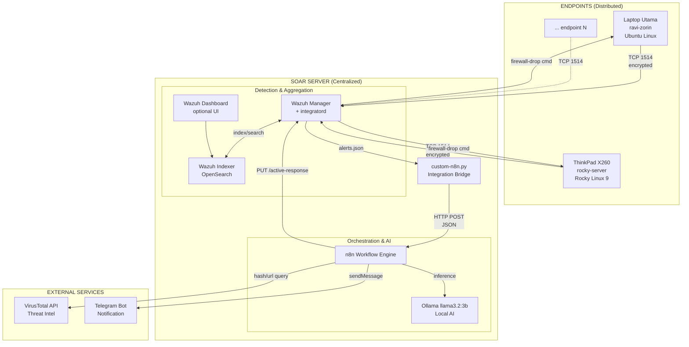
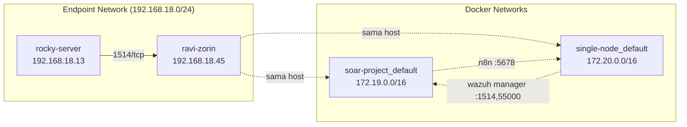
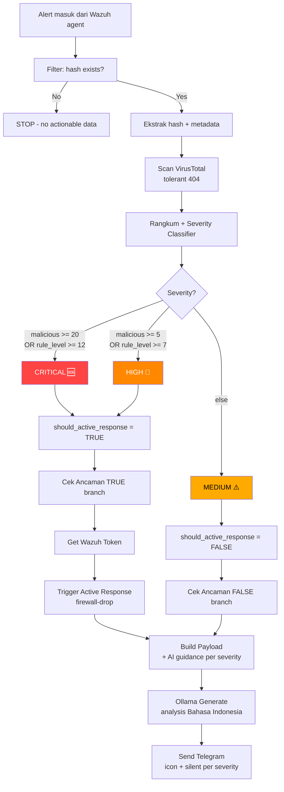
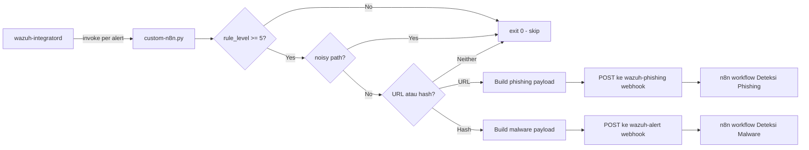

# Arsitektur Sistem SOAR

Dokumentasi arsitektur teknis dari sistem SOAR open-source untuk deteksi malware dan phishing.

## 1. High-Level Architecture



## 2. Layered Architecture

Sistem dirancang dengan **5 layer** terpisah dengan tanggung jawab yang clear:

### Layer 1: Detection (Distributed)

**Lokasi**: Setiap endpoint (laptop, server, workstation)
**Component**: Wazuh Agent (`wazuh-syscheckd`, `wazuh-logcollector`)

**Fungsi**:
- File Integrity Monitoring (FIM) realtime via inotify (Linux) / FileSystemWatcher (Windows)
- Log collection dari `journald`, `/var/log/*`
- Configuration assessment
- Process / network activity monitoring

**Footprint**: ~50 MB RAM, <1% CPU

**Output**: events ke Wazuh Manager via TCP 1514 (encrypted)

### Layer 2: Aggregation & Correlation (Centralized)

**Lokasi**: SOAR Server (Wazuh Manager container)
**Components**:
- `wazuh-remoted` — receive agent connections
- `wazuh-analysisd` — rule matching & decoders
- `wazuh-integratord` — invoke custom integration scripts
- `wazuh-db` — agent state DB

**Fungsi**:
- Decode raw event ke structured JSON
- Match terhadap 4000+ default rules + custom rules
- Generate alert dengan severity level (0-15)
- Trigger integration berdasarkan rule_id whitelist

**Output**: alert → integration script (custom-n8n)

### Layer 3: Orchestration (Centralized)

**Lokasi**: SOAR Server (n8n container)
**Component**: n8n workflow engine

**Fungsi**:
- Receive alert via webhook
- Filter & normalize event data
- Coordinate enrichment (VirusTotal API call)
- Severity classification (multi-source: rule_level + VT score)
- Route ke response action atau notification only

**Output**: action trigger (AR, AI analysis, notification)

### Layer 4: Enrichment & AI (Centralized)

**Components**:
- **VirusTotal API** — external threat intel (hash/URL reputation)
- **Ollama** — local LLM untuk contextual analysis

**Fungsi**:
- VT: lookup hash/URL terhadap 60+ antivirus engines
- Ollama: generate human-readable analysis dalam Bahasa Indonesia
- Severity-aware prompt (CRITICAL → urgent guidance, MEDIUM → informational)
- Markdown sanitization untuk Telegram compatibility

**Privacy**: AI inference berjalan lokal — data tidak keluar dari server

### Layer 5: Response Execution (Distributed)

**Lokasi**: Setiap endpoint (Wazuh agent dengan AR scripts)

**Fungsi**:
- Receive AR command dari Wazuh Manager via existing agent connection
- Execute platform-specific response:
  - Linux: `firewall-drop` → iptables DROP rule
  - Windows: `firewall-drop` → netsh advfirewall
- Auto-expire response setelah timeout (default 10 menit)

**Notification side**: Telegram Bot API delivery

## 3. Network Architecture



**Port Mapping**:

| Service | Container Port | Host Port | Akses |
|---------|----------------|-----------|-------|
| Wazuh agent listener | 1514/tcp | 1514/tcp | Public (untuk agent) |
| Wazuh enrollment | 1515/tcp | 1515/tcp | Public (untuk agent registration) |
| Wazuh API | 55000/tcp | 55000/tcp | Internal (untuk active-response API) |
| Wazuh Indexer | 9200/tcp | 9200/tcp | Internal |
| Wazuh Dashboard | 5601/tcp | 443/tcp | Internal (HTTPS) |
| n8n webhook | 5678/tcp | 5678/tcp | Internal (untuk integratord) |
| Ollama API | 11434/tcp | 11434/tcp | Internal (host service) |

## 4. Workflow Logic — Severity Classification



### Severity Classification Rules

| Severity | Trigger | Telegram | Active Response |
|----------|---------|----------|-----------------|
| **CRITICAL** | `malicious >= 20` OR `rule_level >= 12` | 🆘 KRITIS, **sound on** | ✅ firewall-drop |
| **HIGH** | `malicious >= 5` OR `rule_level >= 7` | 🚨 TINGGI, **sound on** | ✅ firewall-drop |
| **MEDIUM** | (else) | ⚠️ SEDANG, **silent** | ❌ no action |

### AI Prompt per Severity

| Severity | AI Guidance |
|----------|-------------|
| CRITICAL | "Berikan rekomendasi immediate response, isolasi sistem, eradikasi" |
| HIGH | "Berikan rekomendasi tindakan dalam 24 jam, verifikasi dan kontainmen" |
| MEDIUM | "Konteks informational, rekomendasi monitoring rutin" |

## 5. Integration Script Architecture

`scripts/custom-n8n.py` adalah **bridge** antara Wazuh Manager dan n8n webhook.



### Filtering Strategy (Multi-Layer)

1. **rule_level filter** — skip events level < 5 (system noise)
2. **path-based noise filter** — skip legitimate temp paths:
   - Container runtime: `/tmp/runc-process*`
   - Editor/IDE: `/tmp/claude-*`, `/tmp/.vscode-*`
   - Dev runtime: `/tmp/node-compile-cache`, `/tmp/v8-compile-cache`, `/tmp/.bun/`
   - Browser temp: `/tmp/org.chromium.*`, `/tmp/com.brave.*`, `/tmp/mozilla-*`
   - System: `/var/cache/`, `/var/log/`, `/var/tmp/`
3. **event type detection** — URL → phishing webhook, hash → malware webhook

## 6. FIM Monitoring Strategy

Wazuh agent syscheck dikonfigurasi untuk monitor lokasi yang **relevan dengan threat model**, bukan blanket monitoring:

```mermaid
graph TB
    subgraph "Monitored Paths (High-Value)"
        direction TB
        P1["/etc<br/>System config tampering"]
        P2["/usr/local/bin, /usr/local/sbin<br/>Binary replacement T1554"]
        P3["/etc/cron.*, /var/spool/cron<br/>Persistence T1053.003"]
        P4["/etc/systemd/system<br/>Persistence T1543.002"]
        P5["~/Downloads, ~/Desktop<br/>Initial access via phishing T1566"]
        P6["~/.ssh, /root/.ssh<br/>SSH key persistence T1098.004"]
    end

    subgraph "Excluded Paths (Noise)"
        direction TB
        N1["/tmp/* — ephemeral by design"]
        N2["/var/cache/, /var/log/ — rotation"]
        N3["*.O, *.bak, *.dpkg-* — backup files"]
        N4["/etc/cups — printer rotation"]
        N5["/etc/resolv.conf — DHCP/DNS runtime"]
    end
```



### MITRE ATT&CK Mapping

| Monitored Path | MITRE Technique | Description |
|----------------|-----------------|-------------|
| `/etc/cron.*`, `/var/spool/cron` | T1053.003 | Scheduled Task: Cron |
| `/etc/systemd/system` | T1543.002 | Create/Modify System Process: Systemd |
| `~/.ssh/`, `/root/.ssh/` | T1098.004 | Account Manipulation: SSH Keys |
| `/usr/local/bin` | T1554 | Compromise Client Software Binary |
| `~/Downloads`, `~/Desktop` | T1566 | Phishing (initial access) |

## 7. Data Flow Specifications

### Event payload format (Wazuh → n8n)

```json
{
  "rule": {
    "id": "554",
    "level": 5,
    "description": "File added to the system."
  },
  "agent": {
    "id": "002",
    "name": "rocky-server"
  },
  "timestamp": "2026-05-16T20:08:00.000+0000",
  "model": "llama3.2:3b",
  "data": {
    "sha256_after": "275a021bbfb6489e54d471899f7db9d1663fc695ec2fe2a2c4538aabf651fd0f",
    "path": "/home/ravi/Downloads/eicar-rocky-demo2.com",
    "srcip": "0.0.0.0"
  },
  "syscheck": {
    "path": "/home/ravi/Downloads/eicar-rocky-demo2.com",
    "mode": "realtime",
    "size_after": "68",
    "sha256_after": "275a021bbfb6489e54d471899f7db9d1663fc695ec2fe2a2c4538aabf651fd0f",
    "event": "added"
  }
}
```

### Active Response API call (n8n → Wazuh)

```http
PUT /active-response?agents_list=002&wait_for_complete=false HTTP/1.1
Host: 172.20.0.1:55000
Authorization: Bearer eyJ...JWT...
Content-Type: application/json

{
  "command": "!firewall-drop",
  "alert": {
    "data": {
      "srcip": "0.0.0.0"
    }
  }
}
```

### Telegram notification format

```
🆘 KRITIS - MALWARE TERDETEKSI

📁 File: eicar-rocky-demo2.com
📂 Path: /home/ravi/Downloads/eicar-rocky-demo2.com
🔍 Hash: 275a021bbfb6489e54d471899f7db9d1663fc695ec2fe2a2c4538aabf651fd0f
🛡️ Severity: CRITICAL level 5
📊 Deteksi: 65/67
🖥️ Agent: rocky-server
🕐 Waktu: 2026-05-16T20:07:38+0000

🤖 Analisis AI:
[Ollama-generated, severity-aware, Bahasa Indonesia, markdown-sanitized]

🔗 Lihat di VirusTotal
```

## 8. Resource Footprint

### Server Side (laptop utama, 16 GB RAM)

| Component | RAM | CPU |
|-----------|-----|-----|
| Wazuh Manager | ~1.5 GB | 1 core |
| Wazuh Indexer (default heap 4GB) | ~4 GB | 2 core |
| Wazuh Dashboard | ~1 GB | 1 core |
| n8n + task runner | ~700 MB | 1 core |
| Ollama llama3.2:3b | ~4 GB | 2-4 core (CPU inference) |
| **Total** | **~11 GB** | 4+ core |

### Endpoint Side (agent only)

| Component | RAM | CPU |
|-----------|-----|-----|
| Wazuh Agent (`wazuh-syscheckd` + daemons) | ~50 MB | <1% |

## 9. Multi-Agent Scenario (Implemented)

Saat ini terdaftar 2 agent aktif:

```
ID: 000, wazuh.manager  — server localhost
ID: 001, ravi-zorin     — Ubuntu/Debian laptop utama
ID: 002, rocky-server   — Rocky Linux 9 ThinkPad X260
```

Demonstrasi **cross-distribution multi-endpoint SOAR**:
- Agent #1 di Debian-family (Ubuntu) Linux
- Agent #2 di RHEL-family (Rocky 9) Linux
- Sama-sama report ke 1 manager
- Sama-sama dapat AR command (firewall-drop)
- Notifikasi Telegram include `Agent: <name>` untuk identifikasi sumber

## 10. Design Decisions Justification

### Kenapa Wazuh (bukan SIEM lain)?

- Open-source dengan komunitas besar
- Built-in FIM, log analysis, threat detection, AR
- Compatibility cross-platform (Linux/Windows/macOS/Docker)
- REST API matang untuk integration

### Kenapa n8n (bukan Cortex XSOAR / Shuffle)?

- Open-source, no vendor lock-in
- Visual workflow editor
- 200+ pre-built integrations
- Custom Code nodes (JavaScript) untuk advanced logic
- Webhook trigger native (perfect untuk Wazuh integratord)
- Self-hostable via Docker

### Kenapa Ollama lokal (bukan OpenAI/Claude API)?

- **Data sovereignty** — alert data tidak keluar dari infrastruktur
- **No API cost** — cocok untuk continuous monitoring
- **Privacy compliance** — sensitive security data tidak share ke 3rd party
- **Latency stable** — tidak depend pada internet
- Trade-off: lower quality vs cloud LLM, acceptable untuk 2-3 sentence analysis

### Kenapa severity classifier di Rangkum Hasil (bukan Build Payload)?

- **Single source of truth** — severity dihitung sekali, dipakai berkali-kali
- **Cek Ancaman bisa pakai severity** untuk routing AR decision
- **Lebih cohesive** — severity adalah bagian dari "rangkuman" hasil scan

### Kenapa path-based noise filter di script (bukan workflow)?

- **Hemat resource** — event noise tidak masuk ke n8n sama sekali
- **Mudah update** — edit script + restart Wazuh manager
- **Reduce VT API quota usage** (free tier 500/day)
- Trade-off: kalau pattern berubah perlu maintain filter

### Kenapa Telegram (bukan Slack/Email)?

- Mobile-first untuk SOC analyst on-call
- Free tier
- Markdown formatting + silent notification
- Bot API simple (single sendMessage call)
- Cocok untuk personal/SMB SOC

## 11. Threat Model & Limitations

### Threats yang TER-COVER

- Malware file drop (via FIM + VT)
- Suspicious URL access (via custom logging atau proxy integration)
- Persistence attempts (cron, systemd, SSH keys)
- Binary replacement attacks (/usr/local/bin monitoring)
- Multi-platform / multi-distribution endpoint

### Threats yang TIDAK ter-cover (acknowledged)

- **Memory-only / fileless attacks** — FIM tidak detect process injection
- **Encrypted command-and-control** — perlu IDS/IPS terpisah
- **Insider threat** — user dengan akses legitimate
- **Zero-day di kernel/firmware** — di luar FIM scope
- **Supply chain attack** — package manager bypass FIM (kalau pakai legitimate path)

### Production Limitations

- **n8n single instance** — no HA, single point of failure
- **Wazuh SQLite agent DB** — tidak suitable untuk 1000+ agents
- **Ollama single CPU inference** — sequential, 10-60s latency
- **VirusTotal free tier rate limit** — 4 req/min, 500/day
- **Telegram bukan audit-grade** — production butuh SIEM forwarding

## 12. Future Work

- [ ] Replace n8n SQLite ke PostgreSQL HA
- [ ] Ollama scaling via vLLM cluster
- [ ] Multi-tenant workflow support
- [ ] Integration dengan TheHive (incident case management)
- [ ] EDR integration (Velociraptor / osquery)
- [ ] Threat intel feed aggregation (MISP)
- [ ] Phishing detection via real Squid proxy log
- [ ] File quarantine via custom AR script
- [ ] Weekly SOC report generation
