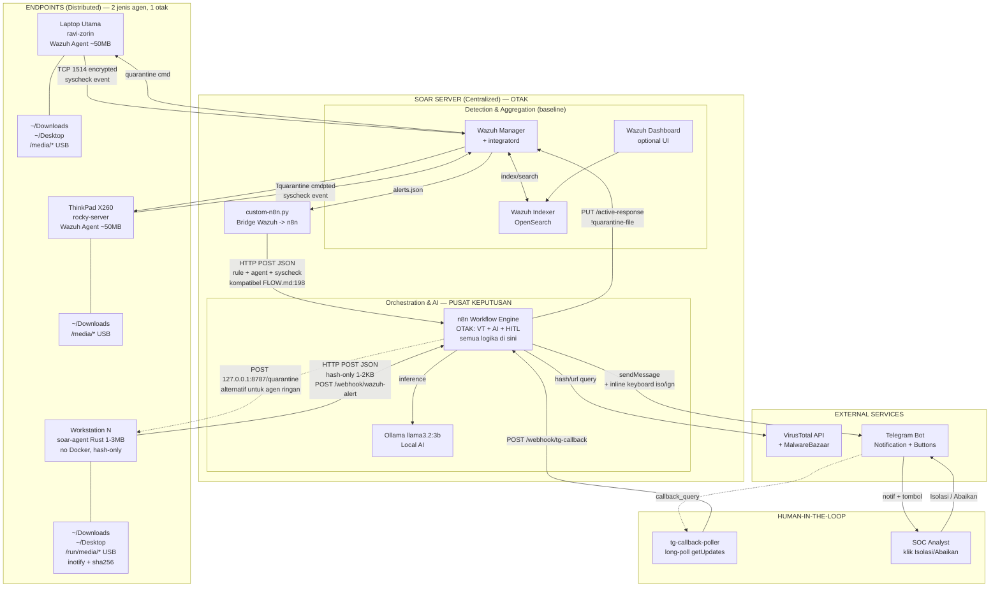
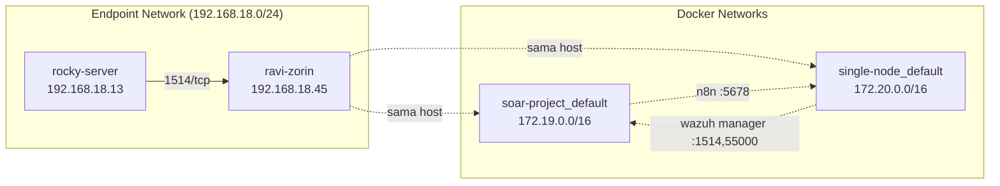
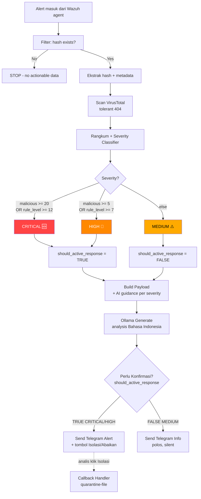
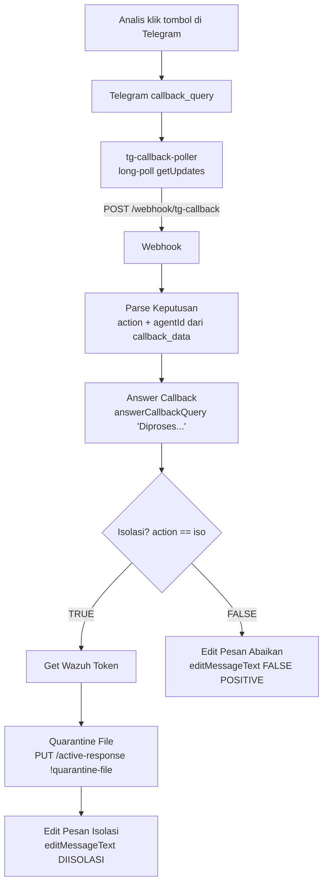
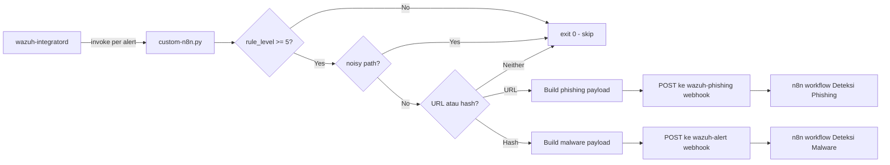

# Arsitektur Sistem SOAR

Dokumentasi arsitektur teknis dari sistem SOAR open-source untuk deteksi malware dan phishing.

## 1. High-Level Architecture

> Revisi 2026-09-04 (tindak lanjut bimbingan 2026-09-03): n8n digambar sebagai **otak orkestrasi pusat**. Dua jalur agen menuju n8n yang sama (Wazuh baseline + agen ringan hash-only). Semua keputusan (VT, AI, Telegram HITL) tetap di n8n.



> **Catatan model AR:** Active Response **tidak otomatis**. Untuk alert
> CRITICAL/HIGH, n8n hanya mengirim notifikasi Telegram dengan dua tombol
> (Isolasi File / Abaikan). Eksekusi `quarantine-file` baru terjadi setelah
> analis menekan "Isolasi File" — keputusan ada di tangan manusia
> (human-in-the-loop), bukan blocking buta.

## 2. Layered Architecture

Sistem dirancang dengan **5 layer** terpisah dengan tanggung jawab yang clear:

### Layer 1: Detection (Distributed)

**Lokasi**: Setiap endpoint (laptop, server, workstation)
**Component**: Wazuh Agent (`wazuh-syscheckd`, `wazuh-logcollector`)

**Fungsi**:
- File Integrity Monitoring (FIM) realtime via inotify (Linux) / FileSystemWatcher (Windows)
- Log collection dari `journald`, `/var/log/*`
- Configuration assessment
- Process / network activity monitoring

**Footprint**: ~50 MB RAM, <1% CPU

**Output**: events ke Wazuh Manager via TCP 1514 (encrypted)

### Layer 2: Aggregation & Correlation (Centralized)

**Lokasi**: SOAR Server (Wazuh Manager container)
**Components**:
- `wazuh-remoted` — receive agent connections
- `wazuh-analysisd` — rule matching & decoders
- `wazuh-integratord` — invoke custom integration scripts
- `wazuh-db` — agent state DB

**Fungsi**:
- Decode raw event ke structured JSON
- Match terhadap 4000+ default rules + custom rules
- Generate alert dengan severity level (0-15)
- Trigger integration berdasarkan rule_id whitelist

**Output**: alert → integration script (custom-n8n)

### Layer 3: Orchestration (Centralized)

**Lokasi**: SOAR Server (n8n container)
**Component**: n8n workflow engine

**Fungsi**:
- Receive alert via webhook
- Filter & normalize event data
- Coordinate enrichment (VirusTotal API call)
- Severity classification (multi-source: rule_level + VT score)
- Route ke response action atau notification only

**Output**: action trigger (AR, AI analysis, notification)

### Layer 4: Enrichment & AI (Centralized)

**Components**:
- **VirusTotal API** — external threat intel (hash/URL reputation)
- **Ollama** — local LLM untuk contextual analysis

**Fungsi**:
- VT: lookup hash/URL terhadap 60+ antivirus engines
- Ollama: generate human-readable analysis dalam Bahasa Indonesia
- Severity-aware prompt (CRITICAL → urgent guidance, MEDIUM → informational)
- Markdown sanitization untuk Telegram compatibility

**Privacy**: AI inference berjalan lokal — data tidak keluar dari server

### Layer 5: Response Execution (Distributed, human-approved)

**Lokasi**: Setiap endpoint (Wazuh agent dengan custom AR script `quarantine-file`)

**Model**: human-in-the-loop. AR **tidak dipicu otomatis** oleh rule; ia hanya
berjalan setelah analis menyetujui lewat tombol Telegram (saran dosen — hindari
isolasi buta atas false positive).

**Fungsi**:
- Untuk alert CRITICAL/HIGH, n8n kirim Telegram + inline keyboard 2 tombol
  (`callback_data` = `iso:<agentId>` / `ign:<agentId>`)
- Analis klik tombol → `tg-callback-poller` (long-poll `getUpdates`, aman di
  balik NAT) teruskan klik ke workflow "Telegram Callback Handler"
- Kalau **Isolasi File**: handler panggil Wazuh API
  `PUT /active-response` dengan `command: !quarantine-file` → agent eksekusi
  script `quarantine-file`: pindahkan file ke `/var/ossec/quarantine` + `chmod 000`
- Kalau **Abaikan**: pesan ditandai FALSE POSITIVE, tidak ada aksi

**Catatan**: node `firewall-drop` lama (auto-AR) sudah **dihapus** dari workflow
(2026-06-03) bersama node `Cek Ancaman` yang menjadi no-op — alur aktif memakai
`quarantine-file` lewat persetujuan analis.

**Notification side**: Telegram Bot API delivery (sendMessage + editMessageText)

## 3. Network Architecture



**Port Mapping**:

| Service | Container Port | Host Port | Akses |
|---------|----------------|-----------|-------|
| Wazuh agent listener | 1514/tcp | 1514/tcp | Public (untuk agent) |
| Wazuh enrollment | 1515/tcp | 1515/tcp | Public (untuk agent registration) |
| Wazuh API | 55000/tcp | 55000/tcp | Internal (untuk active-response API) |
| Wazuh Indexer | 9200/tcp | 9200/tcp | Internal |
| Wazuh Dashboard | 5601/tcp | 443/tcp | Internal (HTTPS) |
| n8n webhook | 5678/tcp | 5678/tcp | Internal (untuk integratord) |
| Ollama API | 11434/tcp | 11434/tcp | Internal (host service) |

## 4. Workflow Logic — Severity Classification



> AR tidak otomatis. `should_active_response=true` hanya menentukan apakah pesan
> Telegram diberi **tombol aksi**; isolasi file dieksekusi setelah analis menekan
> tombol (lihat Section 4b). Node `Get Wazuh Token`/`Trigger Active Response`
> (firewall-drop) lama sudah dihapus dari workflow (2026-06-03).

### Severity Classification Rules

| Severity | Trigger | Telegram | Tombol Aksi (human-in-the-loop) |
|----------|---------|----------|---------------------------------|
| **CRITICAL** | `malicious >= 20` OR `rule_level >= 12` | 🆘 KRITIS, **sound on** | ✅ tombol Isolasi/Abaikan |
| **HIGH** | `malicious >= 5` OR `rule_level >= 7` | 🚨 TINGGI, **sound on** | ✅ tombol Isolasi/Abaikan |
| **MEDIUM** | (else) | ⚠️ SEDANG, **silent** | ❌ info polos, tanpa tombol |

### AI Prompt per Severity

| Severity | AI Guidance |
|----------|-------------|
| CRITICAL | "Berikan rekomendasi immediate response, isolasi sistem, eradikasi" |
| HIGH | "Berikan rekomendasi tindakan dalam 24 jam, verifikasi dan kontainmen" |
| MEDIUM | "Konteks informational, rekomendasi monitoring rutin" |

## 4b. Active Response Interaktif (Human-in-the-Loop)

Saat analis menekan tombol di notifikasi Telegram, klik tersebut diteruskan ke
workflow kedua ("Telegram Callback Handler") lewat poller.



**Kenapa poller, bukan Telegram Trigger node?** n8n Telegram Trigger berbasis
webhook publik. SOAR ini di balik NAT/Tailscale tanpa URL publik, jadi
`tg-callback-poller` melakukan long-poll `getUpdates` (koneksi keluar saja) dan
hanya meneruskan update `callback_query` ke webhook n8n **lokal**. Tidak ada port
n8n yang diekspos ke internet. Poller juga menjalankan `deleteWebhook` saat start
agar tidak konflik (jangan pasang Telegram Trigger node lain di bot yang sama →
bentrok `getUpdates` 409).

**Script AR `quarantine-file`** (di `/var/ossec/active-response/bin/`, root:wazuh
750): baca perintah JSON dari stdin (protokol AR v1), ambil path dari
`extra_args[0]`, pindahkan file ke `/var/ossec/quarantine/<nama>.<ts>.quarantined`
lalu `chmod 000`. Command `delete` (rollback) hanya dicatat, restore manual demi
keamanan.

## 5. Integration Script Architecture

`scripts/custom-n8n.py` adalah **bridge** antara Wazuh Manager dan n8n webhook.



### Filtering Strategy (Multi-Layer)

1. **rule_level filter** — skip events level < 5 (system noise)
2. **path-based noise filter** — skip legitimate temp paths:
   - Container runtime: `/tmp/runc-process*`
   - Editor/IDE: `/tmp/claude-*`, `/tmp/.vscode-*`
   - Dev runtime: `/tmp/node-compile-cache`, `/tmp/v8-compile-cache`, `/tmp/.bun/`
   - Browser temp: `/tmp/org.chromium.*`, `/tmp/com.brave.*`, `/tmp/mozilla-*`
   - System: `/var/cache/`, `/var/log/`, `/var/tmp/`
3. **event type detection** — URL → phishing webhook, hash → malware webhook

## 6. FIM Monitoring Strategy

Wazuh agent syscheck dikonfigurasi untuk monitor lokasi yang **relevan dengan threat model**, bukan blanket monitoring:

```mermaid
graph TB
    subgraph "Monitored Paths (High-Value)"
        direction TB
        P1["/etc<br/>System config tampering"]
        P2["/usr/local/bin, /usr/local/sbin<br/>Binary replacement T1554"]
        P3["/etc/cron.*, /var/spool/cron<br/>Persistence T1053.003"]
        P4["/etc/systemd/system<br/>Persistence T1543.002"]
        P5["~/Downloads, ~/Desktop<br/>Initial access via phishing T1566"]
        P6["~/.ssh, /root/.ssh<br/>SSH key persistence T1098.004"]
    end

    subgraph "Excluded Paths (Noise)"
        direction TB
        N1["/tmp/* — ephemeral by design"]
        N2["/var/cache/, /var/log/ — rotation"]
        N3["*.O, *.bak, *.dpkg-* — backup files"]
        N4["/etc/cups — printer rotation"]
        N5["/etc/resolv.conf — DHCP/DNS runtime"]
    end
```



### MITRE ATT&CK Mapping

| Monitored Path | MITRE Technique | Description |
|----------------|-----------------|-------------|
| `/etc/cron.*`, `/var/spool/cron` | T1053.003 | Scheduled Task: Cron |
| `/etc/systemd/system` | T1543.002 | Create/Modify System Process: Systemd |
| `~/.ssh/`, `/root/.ssh/` | T1098.004 | Account Manipulation: SSH Keys |
| `/usr/local/bin` | T1554 | Compromise Client Software Binary |
| `~/Downloads`, `~/Desktop` | T1566 | Phishing (initial access) |

## 7. Data Flow Specifications

### Event payload format (Wazuh → n8n)

```json
{
  "rule": {
    "id": "554",
    "level": 5,
    "description": "File added to the system."
  },
  "agent": {
    "id": "002",
    "name": "rocky-server"
  },
  "timestamp": "2026-05-16T20:08:00.000+0000",
  "model": "llama3.2:3b",
  "data": {
    "sha256_after": "275a021bbfb6489e54d471899f7db9d1663fc695ec2fe2a2c4538aabf651fd0f",
    "path": "/home/ravi/Downloads/eicar-rocky-demo2.com",
    "srcip": "0.0.0.0"
  },
  "syscheck": {
    "path": "/home/ravi/Downloads/eicar-rocky-demo2.com",
    "mode": "realtime",
    "size_after": "68",
    "sha256_after": "275a021bbfb6489e54d471899f7db9d1663fc695ec2fe2a2c4538aabf651fd0f",
    "event": "added"
  }
}
```

### Active Response API call (Callback Handler → Wazuh)

Dipicu setelah analis menekan "Isolasi File" (bukan otomatis). `arguments[0]`
adalah path file yang akan dikarantina, diteruskan Wazuh ke agent sebagai
`extra_args[0]` untuk script `quarantine-file`.

```http
PUT /active-response?agents_list=002&wait_for_complete=true HTTP/1.1
Host: 172.17.0.1:55000
Authorization: Bearer eyJ...JWT...
Content-Type: application/json

{
  "command": "!quarantine-file",
  "arguments": ["/home/ravi/Downloads/eicar-rocky-demo2.com"]
}
```

### Telegram notification format

```
🆘 KRITIS - MALWARE TERDETEKSI

📁 File: eicar-rocky-demo2.com
📂 Path: /home/ravi/Downloads/eicar-rocky-demo2.com
🔍 Hash: 275a021bbfb6489e54d471899f7db9d1663fc695ec2fe2a2c4538aabf651fd0f
🛡️ Severity: CRITICAL level 5
📊 Deteksi: 65/67
🖥️ Agent: rocky-server
🕐 Waktu: 2026-05-16T20:07:38+0000

🤖 Analisis AI:
[Ollama-generated, severity-aware, Bahasa Indonesia, markdown-sanitized]

🔗 Lihat di VirusTotal
```

## 8. Resource Footprint

### Server Side (laptop utama, 16 GB RAM)

| Component | RAM | CPU | Catatan |
|-----------|-----|-----|---------|
| Wazuh Manager | ~1.5 GB | 1 core |  |
| Wazuh Indexer (heap 1g, light 512m) | ~1-1.5 GB | 1 core | `wazuh-docker/single-node/docker-compose.yml: OPENSEARCH_JAVA_OPTS=-Xms1g` (light: `-Xms512m` di `docker-compose.light.yml`) |
| Wazuh Dashboard | ~1 GB (optional) | 1 core | **Bisa dimatikan** untuk 100 PC — `fleet-monitor :8080` desain Wazuh `#011a2f` jadi pengganti fleet, hemat 1 GB |
| n8n + task runner | ~700 MB | 1 core |  |
| Ollama llama3.2:3b **deprecated** | ~4 GB | 2-4 core | **Full Gemini API sekarang** — hemat 4 GB, latensi 1-3s vs 10-60s (`n8n-workflows/deteksi-malware.json: Gemini Generate`, `GEMINI_API_KEY` di `.env.example`) |
| **Total full (lama)** | **~11 GB** | 4+ core |  |
| **Total light (Gemini + Wazuh light)** | **~5-6 GB** | 2-3 core | Tanpa Dashboard + tanpa Ollama, Indexer 512m — muat 100 rust agent hash-only |

> **Light profile:** `wazuh-docker/single-node/docker-compose.light.yml` (Dashboard `profiles: ["full"]` = off, Indexer 512m). Jalankan `docker compose -f docker-compose.yml -f docker-compose.light.yml up -d` atau cukup host `fleet-monitor` di `:8080` tanpa Dashboard untuk demo 100 PC.

### Endpoint Side (agent only)

| Component | RAM | CPU | Binary | Deploy 100 WS |
|-----------|-----|-----|--------|---------------|
| Wazuh Agent (`wazuh-syscheckd` + daemons) | ~50 MB | <1% | 50 MB + enroll + key | apt/dnf + enroll 1515 |
| soar-agent Rust (`agent-rs/`, hash-only) | 2-5 MB | <1% | 1-3 MB musl static | scp + systemd, no deps |

> Agen ringan kirim **hash-only JSON 1-2 KB**, bukan file utuh (1 GB tetap 1 KB). Cocok untuk 100 workstation. Lihat `docs/AGENT-RINGAN.md:42` dan `agent-rs/README.md`.

## 9. Multi-Agent Scenario (Implemented)

Saat ini terdaftar 2 agent aktif:

```
ID: 000, wazuh.manager  — server localhost
ID: 001, ravi-zorin     — Ubuntu/Debian laptop utama
ID: 002, rocky-server   — Rocky Linux 9 ThinkPad X260
```

Demonstrasi **cross-distribution multi-endpoint SOAR**:
- Agent #1 di Debian-family (Ubuntu) Linux
- Agent #2 di RHEL-family (Rocky 9) Linux
- Sama-sama report ke 1 manager
- Sama-sama bisa menerima AR command (`quarantine-file`, setelah approval analis)
- Notifikasi Telegram include `Agent: <name>` untuk identifikasi sumber

## 10. Design Decisions Justification

### Kenapa Wazuh (bukan SIEM lain)?

- Open-source dengan komunitas besar
- Built-in FIM, log analysis, threat detection, AR
- Compatibility cross-platform (Linux/Windows/macOS/Docker)
- REST API matang untuk integration

### Kenapa n8n (bukan Cortex XSOAR / Shuffle)?

- Open-source, no vendor lock-in
- Visual workflow editor
- 200+ pre-built integrations
- Custom Code nodes (JavaScript) untuk advanced logic
- Webhook trigger native (perfect untuk Wazuh integratord)
- Self-hostable via Docker

### Kenapa Gemini API (full, bukan Ollama lokal)? — update 2026-09-03

- **Hemat 4 GB** — `Ollama llama3.2:3b` butuh 4 GB RAM + 2-4 core, latensi 10-60s sekuensial (bottleneck 100 PC). `Gemini 2.0 Flash` API 1-3s, scale cloud.
- **Kualitas** lebih baik untuk 2-3 kalimat Bahasa Indonesia formal.
- Trade-off: **data keluar infra** (hash, path, hostname ke Google), butuh `GEMINI_API_KEY` + internet, quota 60 req/menit. Untuk TA, Wazuh + hash-only tetap lokal, hanya AI yang cloud — kompromi 100 PC.
- **Dulu Ollama:** data sovereignty, no cost, privacy — cocok kalau resource cukup atau butuh offline. Sekarang deprecated, tapi bisa fallback kalau `GEMINI_API_KEY` kosong.

### Kenapa severity classifier di Rangkum Hasil (bukan Build Payload)?

- **Single source of truth** — severity dihitung sekali, dipakai berkali-kali
- **`Perlu Konfirmasi` pakai `should_active_response`** untuk routing notifikasi
  (alert + tombol vs info silent)
- **Lebih cohesive** — severity adalah bagian dari "rangkuman" hasil scan

### Kenapa path-based noise filter di script (bukan workflow)?

- **Hemat resource** — event noise tidak masuk ke n8n sama sekali
- **Mudah update** — edit script + restart Wazuh manager
- **Reduce VT API quota usage** (free tier 500/day)
- Trade-off: kalau pattern berubah perlu maintain filter

### Kenapa Telegram (bukan Slack/Email)?

- Mobile-first untuk SOC analyst on-call
- Free tier
- Markdown formatting + silent notification
- Bot API simple (single sendMessage call)
- Cocok untuk personal/SMB SOC

## 11. Threat Model & Limitations

### Threats yang TER-COVER

- Malware file drop (via FIM + VT)
- Suspicious URL access (via custom logging atau proxy integration)
- Persistence attempts (cron, systemd, SSH keys)
- Binary replacement attacks (/usr/local/bin monitoring)
- Multi-platform / multi-distribution endpoint

### Threats yang TIDAK ter-cover (acknowledged)

- **Memory-only / fileless attacks** — FIM tidak detect process injection
- **Encrypted command-and-control** — perlu IDS/IPS terpisah
- **Insider threat** — user dengan akses legitimate
- **Zero-day di kernel/firmware** — di luar FIM scope
- **Supply chain attack** — package manager bypass FIM (kalau pakai legitimate path)

### Production Limitations

- **n8n single instance** — no HA, single point of failure
- **Wazuh SQLite agent DB** — tidak suitable untuk 1000+ agents
- **Ollama single CPU inference** — sequential, 10-60s latency
- **VirusTotal free tier rate limit** — 4 req/min, 500/day
- **Telegram bukan audit-grade** — production butuh SIEM forwarding

## 12. Future Work

- [ ] Replace n8n SQLite ke PostgreSQL HA
- [ ] Ollama scaling via vLLM cluster
- [ ] Multi-tenant workflow support
- [ ] Integration dengan TheHive (incident case management)
- [ ] EDR integration (Velociraptor / osquery)
- [ ] Threat intel feed aggregation (MISP)
- [ ] Phishing detection via real Squid proxy log
- [x] File quarantine via custom AR script (human-in-the-loop, lihat Section 4b)
- [ ] Weekly SOC report generation
- [x] Bersihkan node firewall-drop yatim di deteksi-malware.json (2026-06-03)
