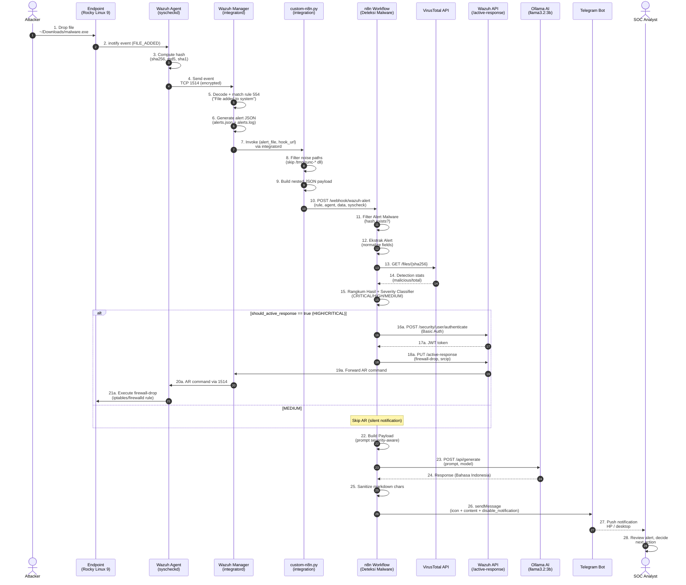
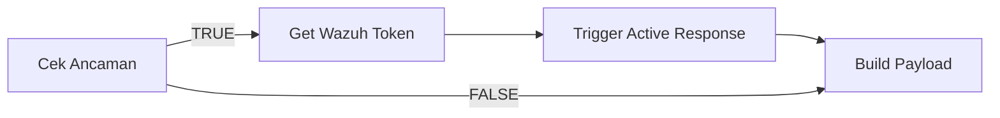
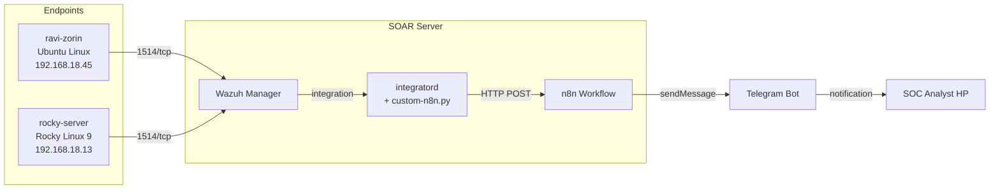

# Alur Kerja End-to-End SOAR Pipeline

Dokumentasi alur data step-by-step dari file event sampai response delivery.

## Diagram Alur Lengkap



## Step-by-Step Penjelasan

### Phase 1: Detection (di Endpoint)

**Step 1-3: File event detection**

User (atau attacker) menulis file baru. Wazuh agent's `wazuh-syscheckd` daemon yang sudah subscribe ke kernel inotify event langsung detect:

```bash
# Event di kernel level
inotify: IN_CREATE event on /home/ravi/Downloads/malware.exe

# Agent action
syscheckd:
  - calculate sha256, sha1, md5, size, perm
  - check against baseline (in /var/ossec/queue/diff/local)
  - kalau new file → fire event
```

Waktu eksekusi: **<100 ms** dari file write sampai event generated.

**Step 4: Forward ke manager**

Agent kirim event via existing connection (port 1514, encrypted dengan pre-shared key).

```
TCP 1514 → wazuh.manager:1514
Payload: encrypted Wazuh-specific protocol
```

### Phase 2: Aggregation (di Wazuh Manager)

**Step 5-6: Rule matching**

`wazuh-analysisd` daemon decode event dan match terhadap rules:

```
Decoder: syscheck → parse syscheck XML attributes
Rule matched: 554 "File added to the system" (level 5)
Output: alerts.json + alerts.log entry
```

**Step 7: Trigger integratord**

`wazuh-integratord` daemon poll `alerts.json`. Kalau alert match konfigurasi `<integration>` di `ossec.conf`:

```xml
<integration>
  <name>custom-n8n</name>
  <hook_url>http://172.20.0.1:5678/webhook/wazuh-alert</hook_url>
  <rule_id>554,550,553,552,551</rule_id>
  <alert_format>json</alert_format>
</integration>
```

Integratord invoke script dengan signature:
```
/var/ossec/integrations/custom-n8n <alert_file_path> <api_key> <hook_url>
```

### Phase 3: Integration Bridge (custom-n8n.py)

**Step 8: Filtering**

Script multi-stage filter:

```python
# Stage 1: rule_level threshold
if rule_level < 5:
    sys.exit(0)

# Stage 2: noisy path check
if file_path.startswith(NOISY_PATH_PREFIXES):
    sys.exit(0)
```

Noisy paths termasuk: `/tmp/runc-process*`, `/tmp/node-compile-cache`, `/tmp/org.chromium.*`, `/var/cache/`, dll.

**Step 9: Format conversion**

Convert Wazuh flat alert format ke **nested JSON** yang dipahami workflow:

```python
payload = {
    "rule": {"id": rule_id, "level": rule_level, "description": ...},
    "agent": {"id": agent_id, "name": agent_name},
    "timestamp": timestamp,
    "model": "llama3.2:3b",
    "data": {
        "sha256_after": hash_value,
        "path": file_path,
        "srcip": srcip,
    },
    "syscheck": alert.get("syscheck", {})
}
```

**Step 10: HTTP POST ke webhook**

```python
urllib.request.urlopen(
    Request(hook_url, data=json.dumps(payload).encode(),
            headers={"Content-Type": "application/json"}),
    timeout=10
)
```

### Phase 4: Orchestration (di n8n)

**Step 11: Filter Alert Malware (IF node)**

Multi-path hash detection:
```javascript
{{ !!(($json.body ?? $json).syscheck?.sha256_after
   || ($json.body ?? $json).syscheck?.sha256_before
   || ($json.body ?? $json).data?.sha256_after
   || ($json.body ?? $json).data?.hash
   || ($json.body ?? $json).sha256
   || ($json.body ?? $json).md5) }}
```

TRUE → lanjut. FALSE → drop (no Telegram).

**Step 12: Ekstrak Alert (Code node)**

Normalize berbagai possible format ke single structure:
```javascript
const hash = body?.syscheck?.sha256_after
          || body?.syscheck?.sha256_before
          || body?.data?.sha256_after
          || body?.data?.hash
          || ...
return [{ json: { rule_id, hash, filename, filepath, srcip, agent_id, agent_name, timestamp } }];
```

**Step 13-14: VirusTotal scan (HTTP Request)**

```http
GET https://www.virustotal.com/api/v3/files/{sha256}
X-Apikey: <VT_API_KEY>
```

Response:
```json
{
  "data": {
    "attributes": {
      "last_analysis_stats": {
        "malicious": 65,
        "suspicious": 0,
        "undetected": 2,
        "harmless": 0
      }
    }
  }
}
```

`neverError: true` flag — kalau hash 404 (unknown), workflow tetap lanjut dengan `malicious=0`.

**Step 15: Severity Classifier (Code node di Rangkum Hasil)**

```javascript
if (malicious >= 20 || ruleLevel >= 12) {
  severity = 'CRITICAL'; severityIcon = '🆘'; silent = false;
} else if (malicious >= 5 || ruleLevel >= 7) {
  severity = 'HIGH'; severityIcon = '🚨'; silent = false;
} else {
  severity = 'MEDIUM'; severityIcon = '⚠️'; silent = true;
}
const should_active_response = severity !== 'MEDIUM';
```

### Phase 5: Decision & Response

**Step 16-21: Active Response (kalau severity HIGH/CRITICAL)**

Cek Ancaman IF node check `$json.should_active_response == true`:



Get Wazuh Token (Basic Auth → JWT):
```http
POST https://172.17.0.1:55000/security/user/authenticate
Authorization: Basic <base64(wazuh-wui:password)>
```

Trigger Active Response (with JWT):
```http
PUT https://172.17.0.1:55000/active-response?agents_list=002&wait_for_complete=false
Authorization: Bearer <JWT>
Content-Type: application/json

{"command": "!firewall-drop", "alert": {"data": {"srcip": "0.0.0.0"}}}
```

Wazuh Manager kemudian forward command ke target agent via existing TCP 1514 connection. Agent's `wazuh-execd` execute `firewall-drop` script:

```bash
# Default Wazuh firewall-drop di Linux:
iptables -I INPUT -s <srcip> -j DROP

# Default at Rocky/RHEL (firewalld):
firewall-cmd --add-rich-rule="rule source address=<srcip> drop"
```

Default timeout 10 menit → rule auto-removed.

### Phase 6: AI Enrichment

**Step 22-24: Ollama analysis**

Build Payload prepare severity-aware prompt:

```
You are a cybersecurity analyst. Respond ONLY in formal Bahasa Indonesia.
Write exactly 2-3 sentences. No extra explanation. JANGAN gunakan karakter markdown.

Severity: CRITICAL Wazuh level 5, malicious 65 dari 67
File: eicar-rocky-demo2.com
Hash: 275a021bbf...
VirusTotal: 65 dari 67 antivirus mendeteksi file ini sebagai malware.

Konteks: ancaman KRITIS. Berikan rekomendasi immediate response, isolasi sistem, dan eradikasi.
Jelaskan tingkat bahaya file ini dan berikan rekomendasi tindakan yang harus diambil.
```

Ollama Generate (Code node) call:
```http
POST http://172.17.0.1:11434/api/generate
Content-Type: application/json

{
  "model": "llama3.2:3b",
  "prompt": "<prompt above>",
  "stream": false,
  "options": {"num_predict": 150}
}
```

Response cleaning:
```javascript
let cleanResponse = response.response
  .replace(/<think>[\s\S]*?<\/think>/g, '')  // strip thinking tags
  .replace(/[*_`\[\]()]/g, '')                 // strip markdown chars
  .replace(/\n\n+/g, '\n')                     // collapse newlines
  .trim();
```

Markdown sanitization penting karena Telegram `parse_mode: Markdown` reject unbalanced asterisks/underscores → 400 error.

### Phase 7: Notification Delivery

**Step 25-27: Telegram message**

Template:
```javascript
text: expr(`={{ $json.severityIcon + " *" + $json.severityLabel + " - MALWARE TERDETEKSI*\\n\\n" +
            "📁 File: " + $("Ekstrak Alert").first().json.filename + "\\n" +
            "📂 Path: " + $("Ekstrak Alert").first().json.filepath + "\\n" +
            "🔍 Hash: `" + $json.hash_display + "`\\n" +
            "🛡️ Severity: " + $json.severity + " level " + $json.rule_level + "\\n" +
            "📊 Deteksi: " + $json.detection_text + "\\n" +
            "🖥️ Agent: " + $("Ekstrak Alert").first().json.agent_name + "\\n" +
            "🕐 Waktu: " + $("Ekstrak Alert").first().json.timestamp + "\\n\\n" +
            "🤖 *Analisis AI:*\\n" + $json.ollama_response + "\\n\\n" +
            $json.vt_footer }}`)
```

Conditional silent untuk MEDIUM:
```javascript
additionalFields: {
  parse_mode: 'Markdown',
  disable_notification: expr('={{ $json.silent }}')  // true untuk MEDIUM
}
```

## Latency Breakdown

End-to-end latency dari file drop sampai Telegram delivery (observed):

| Step | Duration |
|------|----------|
| 1-4: File detect + agent send | ~100 ms |
| 5-7: Manager process + integratord | ~50 ms |
| 8-10: Script execute + webhook POST | ~150 ms |
| 11-12: Workflow filter + ekstrak | ~30 ms |
| 13-14: **VirusTotal scan** | **5-15 s** |
| 15: Severity classifier | ~10 ms |
| 16-21: Active Response (kalau fire) | ~500 ms |
| 22-24: **Ollama AI inference** | **15-50 s** (CPU-bound) |
| 25-27: Markdown sanitize + Telegram | ~1 s |
| **TOTAL** | **30-60 detik** |

**Bottleneck utama**:
1. Ollama inference (CPU-bound LLM, sequential)
2. VirusTotal API call (network latency)

## Failure Scenarios Handled

### Skenario 1: VirusTotal hash unknown (404)

```
VT response: 404 NotFoundError
Workflow action: continue dengan malicious=0, severity berdasarkan rule_level
Notification: "Belum dikenali VirusTotal" + footer "Hash belum disubmit ke VT"
```

### Skenario 2: VirusTotal API down / timeout

```
VT response: timeout / connection error
Workflow action: error caught (neverError: true di node options)
Notification: tetap kirim, severity berdasarkan rule_level only
```

### Skenario 3: Ollama crash / slow

```
Ollama: timeout setelah 5 menit
Workflow: error di Code node
Mitigation: di-restart workflow akan retry
```

### Skenario 4: Wazuh agent disconnect

```
Manager log: "Agent ID 002 inactive (no keep_alive)"
Workflow: tidak akan trigger (alert tidak masuk)
Recovery: agent reconnect otomatis (default 60s retry)
```

### Skenario 5: n8n down

```
integratord log: "ERROR send: Connection refused"
Workflow: alert hilang (no queue)
Mitigation: monitor /var/ossec/logs/integrations.log
Production fix: add Redis queue between integratord-n8n
```

### Skenario 6: Telegram bot blocked / rate limited

```
Telegram response: 429 Too Many Requests
Workflow: error di Send Telegram node
Mitigation: implement backoff retry (currently not implemented)
```

## Multi-Agent Flow (Implemented)



Setiap alert include `agent.name` di Telegram message, sehingga SOC analyst tahu mana endpoint yang affected.

## Audit Trail

Setiap event meninggalkan trail untuk forensic:

1. **Wazuh agent log**: `/var/ossec/logs/ossec.log` (di endpoint)
2. **Wazuh alert log**: `/var/ossec/logs/alerts/alerts.log` (di manager)
3. **Wazuh AR log**: `/var/ossec/logs/active-responses.log` (di endpoint)
4. **Integration log**: `/var/ossec/logs/integrations.log` (di manager)
5. **n8n execution log**: viewable di n8n UI `/workflow/<id>/executions`
6. **Telegram message history**: viewable di Telegram chat (persistent)

Untuk thesis, screenshot dari semua log adalah bukti verifikasi sistem berfungsi.
