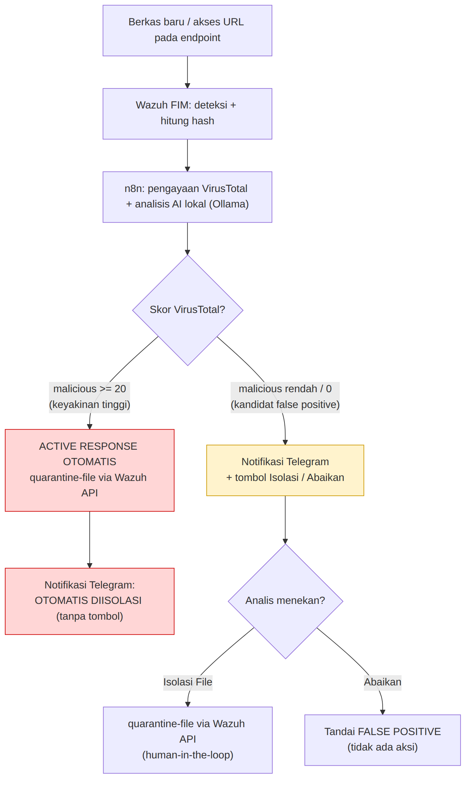

# KARTU CONTEKAN DEMO — SOAR Open-Source

**Implementasi Sistem SOAR Open-Source Berbasis n8n untuk Deteksi dan Respons Ancaman Malware dan Phishing dengan Mitigasi Aktif Human-in-the-Loop**

Ravi Arnan Irianto (2305551076)

---

## 0. PRE-FLIGHT (±5 menit sebelum tampil)

```bash
cd ~/Projects/soar-project
# 1. Nyalakan stack (lewati jika sudah hidup / habis reboot otomatis hidup)
docker compose up -d
cd wazuh-docker/single-node && docker compose up -d && cd ../..

# 2. Pastikan 2 agent Active
docker exec single-node-wazuh.manager-1 /var/ossec/bin/agent_control -l

# 3. WAJIB: hangatkan Ollama (kalau dingin, inferensi pertama lambat)
ollama run llama3.2:3b "test" >/dev/null

# 4. Tes 1x sebelum tampil (pastikan Telegram nyampe)
printf '%s' 'X5O!P%@AP[4\PZX54(P^)7CC)7}$EICAR-STANDARD-ANTIVIRUS-TEST-FILE!$H+H*' > ~/Downloads/eicar-cek.com
```

Cek di n8n (`http://localhost:5678`) → 3 workflow **Active**. Dashboard Wazuh: `https://localhost:443`.

---

## 1. ALUR SISTEM (tunjukkan diagram ini)

{width=3.1in}

**Inti cerita:** respons berjenjang sesuai **tingkat keyakinan**. Sistem yakin → bertindak otomatis. Sistem ragu → menyerahkan keputusan ke analis (human-in-the-loop). Semua dibangun dari perangkat **open-source**.

**Prinsip kunci (anti false-positive):** otoritas deteksi adalah **VirusTotal** (60+ antivirus), bukan sekadar "ada file baru" dari Wazuh FIM. Sistem **hanya bersuara saat VirusTotal benar-benar mendeteksi (malicious ≥ 1)**:

| Hasil VirusTotal | Tindakan |
|------------------|----------|
| **≥ 20** terdeteksi | 🆘 Auto-isolasi (tanpa tombol) |
| **1–19** terdeteksi | 🚨 Tombol Telegram — analis memutuskan |
| **0** (bersih / hash tak dikenal) | ✅ Diam — tidak ada notifikasi |

Artefak sementara (temp browser `.org.chromium.*`, unduhan separuh `.crdownload`, file kosong) **difilter sebelum** menyentuh VirusTotal.

---

## 2. SKENARIO 1 — AUTO-ISOLATE (keyakinan tinggi)

**Aksi:**
```bash
printf '%s' 'X5O!P%@AP[4\PZX54(P^)7CC)7}$EICAR-STANDARD-ANTIVIRUS-TEST-FILE!$H+H*' > ~/Downloads/malware-demo.com
```

**Yang terjadi (±15–30 dtk):** Wazuh FIM deteksi → VirusTotal **≈59 dari 70+ antivirus malicious** (≥ 20) → severity KRITIS → AI lokal analisis → **file otomatis dikarantina** → Telegram: **"OTOMATIS DIISOLASI"** (tanpa tombol).

**Buktikan:**
```bash
ls ~/Downloads/malware-demo.com           # sudah HILANG
sudo ls -l /var/ossec/quarantine/         # file ada di sini, mode 000
```

**Narasi:** *"VirusTotal sangat yakin ini malware (65 dari 67 antivirus). Untuk ancaman seperti ini, menunggu manusia hanya menambah risiko, jadi SOAR langsung mengkarantina otomatis — MTTR mendekati nol."*

---

## 3. SKENARIO 2 — HUMAN-IN-THE-LOOP (ancaman ambigu)

**Kapan jalur ini aktif di produksi:** VirusTotal mendeteksi **1–19 antivirus** — mencurigakan tapi belum pasti. Sistem tidak bertindak buta, malah meminta keputusan analis.

**Aksi (demo reproducible lewat FIM asli):** jatuhkan file dengan penanda demo `demoreview` pada namanya:
```bash
echo "dokumen kerja yang sah" > ~/Downloads/demoreview-laporan-rapat.txt
```
> Penanda `demoreview` memaksa jalur konfirmasi agar bisa diperagakan kapan saja tanpa perlu sampel malware deteksi-rendah. File biasa lain tetap di-suppress bila VirusTotal bersih. Hapus penanda untuk perilaku produksi murni.

**Yang terjadi:** Wazuh FIM deteksi file baru → pipeline → AI lokal analisis → Telegram **dengan tombol [Isolasi File] [Abaikan (False Positive)]**.

**Aksi di HP:** klik salah satu tombol.
- **Isolasi File** → pesan jadi "DIISOLASI", file dikarantina.
- **Abaikan** → pesan jadi "FALSE POSITIVE", file dibiarkan.

**Narasi:** *"Untuk deteksi rendah atau ambigu, daripada salah mengkarantina file kerja yang sah, sistem menyerahkan keputusan ke analis lewat satu klik di Telegram — ini human-in-the-loop, masukan dari dosen pembimbing: hindari isolasi buta."*

---

## 3b. SKENARIO 3 — FILE BERSIH (bukti anti false-positive) ⭐

**Aksi:** unduh/buat file biasa seperti foto atau dokumen:
```bash
echo "foto liburan biasa" > ~/Downloads/foto-liburan.jpg
```

**Yang terjadi:** Wazuh tetap mencatat file baru, tapi VirusTotal **bersih (0 deteksi)** → **TIDAK ADA notifikasi sama sekali**. Telegram tetap sunyi.

**Narasi:** *"Sebelumnya setiap unduhan — foto, ISO, file config — dianggap malware. Itu false positive yang memicu alert fatigue: analis membanjiri inbox lalu mengabaikan semuanya. Sekarang sistem hanya bersuara saat VirusTotal benar-benar menemukan sesuatu. Inilah yang membedakan SOAR matang dari sekadar penerus alert."*

---

## 4. KOMPONEN (untuk sesi tanya-jawab)

| Komponen | Peran |
|----------|-------|
| **Wazuh** | SIEM + HIDS: File Integrity Monitoring, korelasi aturan, eksekusi Active Response |
| **n8n** | Mesin orkestrasi (otak SOAR): playbook deteksi → pengayaan → keputusan |
| **VirusTotal** | Threat intelligence: reputasi hash/URL terhadap 60+ antivirus |
| **Ollama (llama3.2:3b)** | Analisis AI **lokal** → kedaulatan data, tanpa biaya API |
| **Telegram Bot** | Kanal notifikasi + antarmuka keputusan dua arah |
| **tg-callback-poller** | Meneruskan klik tombol ke n8n (aman di balik NAT, long-poll) |
| **Tailscale** | Mesh VPN: agent tetap terhubung walau beda jaringan |

**Multi-agent:** 2 endpoint lintas distribusi — Ubuntu (ravi-zorin) + Rocky Linux 9 (rocky-server), lapor ke 1 manager.

---

## 5. POIN JUAL / KEBARUAN
1. **SOAR penuh dari open-source** — kapabilitas yang biasanya hanya di Cortex XSOAR / Splunk (mahal).
2. **Respons berjenjang (confidence-based):** auto untuk keyakinan tinggi, human-in-the-loop untuk ambigu.
3. **Deteksi berbasis intelijen, bukan kebisingan FIM** → keputusan diikat ke konsensus VirusTotal (60+ engine), sehingga **false positive ditekan** dan tidak ada alert fatigue.
4. **AI lokal** → data sensitif tidak keluar infrastruktur.
5. **Lintas distribusi + resilient** (Tailscale).

---

## 6. TROUBLESHOOTING CEPAT
| Gejala | Tindakan |
|--------|----------|
| Telegram lama (>1 mnt) | Wajar bila Ollama dingin / VT lambat — jelaskan; sudah dihangatkan saat pre-flight |
| Notifikasi tidak muncul | Cek workflow Active di n8n; cek `docker logs n8n --tail 20` |
| Banyak alert serentak error | Sudah dimitigasi (timeout 300s) — picu **1 alert per kali** |
| Agent tidak Active | `sudo systemctl restart wazuh-agent` di endpoint |
| Tombol diklik tak ada efek | Cek `docker logs tg-callback-poller --tail 10` (harus "forwarded callback_query") |

**Cadangan (jika FIM/agent rewel)** — picu pipeline langsung via webhook.

Auto-isolasi (EICAR):
```bash
curl -X POST http://localhost:5678/webhook/wazuh-alert -H 'Content-Type: application/json' \
 -d '{"rule":{"id":"554","level":7,"description":"File added."},"agent":{"id":"001","name":"ravi-zorin"},"syscheck":{"path":"/home/ravi/Downloads/malware-demo.com","sha256_after":"275a021bbfb6489e54d471899f7db9d1663fc695ec2fe2a2c4538aabf651fd0f","event":"added"}}'
```

Human-in-the-loop (tombol) — penanda `demoreview` di path:
```bash
curl -X POST http://localhost:5678/webhook/wazuh-alert -H 'Content-Type: application/json' \
 -d '{"rule":{"id":"554","level":7,"description":"File added."},"agent":{"id":"001","name":"ravi-zorin"},"syscheck":{"path":"/home/ravi/Downloads/demoreview-uji.txt","sha256_after":"f9120c06aad5aa4add1b646456199fd34b4fa72c6eb8ba4d37d85a59d7cac478","event":"added"}}'
```

---

## 7. VERIFIKASI CEPAT (saat ditanya bukti)
```bash
# Alert tercatat di Wazuh
docker exec single-node-wazuh.manager-1 grep malware-demo /var/ossec/logs/alerts/alerts.json | tail -1
# Eksekusi n8n (buka tab Executions di UI) + log Active Response
sudo tail -5 /var/ossec/logs/active-responses.log
```
