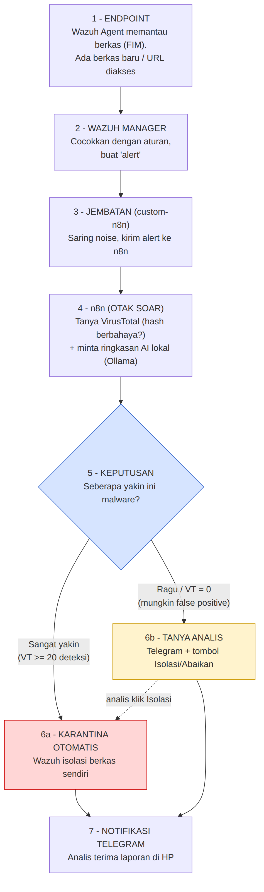

# Panduan Memahami Diagram SOAR (Versi Mudah)

Tujuan: paham alur sistem **tanpa hafalan**, cukup ikuti nomor 1 sampai 7.

## Analogi singkat
Bayangkan sistem ini seperti **3 orang yang bekerja sama**:

- **Satpam** (Wazuh Agent) — menjaga pintu, melihat ada berkas/tamu baru.
- **Laboratorium** (n8n + VirusTotal + AI) — memeriksa apakah tamu itu berbahaya.
- **Atasan/Analis** (kamu, lewat Telegram) — mengambil keputusan saat lab ragu.

---

## Gambar Alur (ikuti nomornya)

{width=2.3in}

---

## Penjelasan tiap nomor

**1 — ENDPOINT (komputer yang dijaga).**
Wazuh Agent memantau folder penting (mis. `~/Downloads`) memakai *FIM* (File Integrity Monitoring). Begitu ada **berkas baru**, ia langsung tahu dan menghitung "sidik jari" berkas (*hash*).

**2 — WAZUH MANAGER (pusat).**
Agent melapor ke Manager. Manager mencocokkan kejadian dengan **aturan** dan membuat catatan bernama **alert** (= "ada sesuatu yang perlu diperiksa").

**3 — JEMBATAN (`custom-n8n`).**
Skrip kecil yang **menyaring** kejadian tidak penting (noise) lalu mengirim alert yang relevan ke n8n. Ibarat resepsionis yang hanya meneruskan tamu penting.

**4 — n8n: OTAK SOAR.**
Di sinilah "pemeriksaan lab" terjadi, otomatis:
- Tanya **VirusTotal**: "sidik jari ini dikenal sebagai malware? berapa antivirus yang setuju?"
- Minta **Ollama (AI lokal)** membuat ringkasan singkat berbahasa Indonesia.

**5 — KEPUTUSAN (inti sistem).**
Sistem bertanya: **"seberapa yakin ini malware?"** Jawabannya menentukan dua jalur di bawah.

**6a — KARANTINA OTOMATIS** (kotak merah).
Kalau **VirusTotal sangat yakin** (≥ 20 antivirus bilang berbahaya), tidak perlu menunggu manusia — Wazuh langsung **mengisolasi berkas sendiri** (`quarantine-file`). Cepat, karena risikonya jelas.

**6b — TANYA ANALIS** (kotak kuning).
Kalau **VirusTotal ragu / 0 deteksi** (mungkin malware baru, mungkin *false positive*), sistem **tidak bertindak buta**. Ia kirim Telegram **dengan tombol [Isolasi File] / [Abaikan]** dan menyerahkan keputusan ke analis (*human-in-the-loop*). Kalau analis klik "Isolasi", barulah berkas dikarantina (panah putus-putus ke 6a).

**7 — NOTIFIKASI TELEGRAM.**
Apa pun jalurnya, analis menerima laporan lengkap di HP: nama berkas, skor VirusTotal, ringkasan AI, dan status (otomatis diisolasi / menunggu keputusan).

---

## Dua jalur — kunci untuk diingat

| Kondisi | Jalur | Kenapa |
|---------|-------|--------|
| VirusTotal **deteksi tinggi** | **6a Otomatis** | Sudah jelas bahaya → bertindak cepat (MTTR rendah) |
| VirusTotal **0 / rendah** | **6b Tanya analis** | Ambigu → hindari salah karantina berkas sah |

Satu kalimat untuk diingat: **"Yakin → tindak sendiri. Ragu → tanya manusia."**

---

## Siapa bicara ke siapa (arsitektur singkat)

```
Endpoint (Agent)  --1514-->  Wazuh Manager  --alert-->  n8n
                                                          |--> VirusTotal (intel)
                                                          |--> Ollama (AI lokal)
                                                          |--> Telegram (notif + tombol)
Analis klik tombol --> poller --> n8n --> Wazuh API --> Agent (karantina)
```

- Panah **ke kanan** = alur deteksi (berkas → laporan).
- Panah **balik** (Analis → Agent) = alur respons (keputusan → tindakan).
- Semua komponen **open-source** dan AI berjalan **lokal** (data tidak keluar).

---

## Tips membaca diagram lain di folder `diagrams/`
- `overview-bernomor.png` — **mulai dari sini** (paling mudah).
- `demo-hybrid-flow.png` — versi keputusan auto vs tombol (untuk demo).
- `fig-3.3-arsitektur.png` — peta komponen lengkap (siapa terhubung ke siapa).
- `fig-3.4-pipeline.png` — alur pipeline rinci.
- `fig-3.5-sequence-ar.png` — urutan waktu saat analis klik tombol.
</content>
