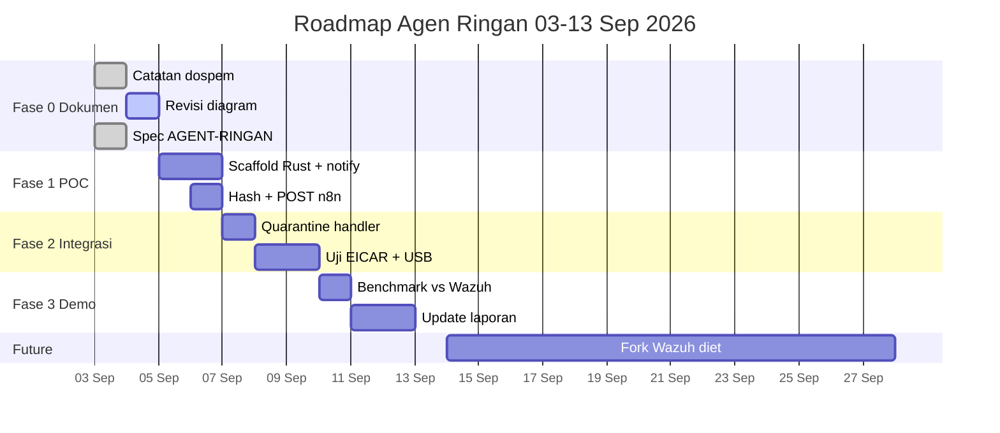

# Roadmap Agen Ringan - SOAR TA

> Tindak lanjut bimbingan 2026-09-03. Target: jawab kritik dospem "agen berat untuk 100 workstation" dengan POC yang bisa didemo minggu depan, tanpa bongkar sistem Wazuh yang sudah jalan.

Status induk ada di `ROADMAP.md` bagian *Status ringkas* (baris kategori I). Dokumen ini adalah **rincian eksekusi kategori I** (Agen Ringan). Bahasa implementasi: **Rust** (`agent-rs/`), bukan Go — alasan pilihan ada di `docs/AGENT-RINGAN.md:45`.

## Prinsip

- Wazuh tetap baseline. Agen ringan adalah **jalur alternatif**, bukan pengganti total minggu ini. Satu POC jalan lebih berharga dari fork setengah jadi.
- ponytail: agen hanya 3 tugas (pantau file, hitung hash, kirim JSON). Semua keputusan tetap di n8n `docs/FLOW.md:40`.
- Kompatibilitas: payload Rust (`agent-rs/src/main.rs:build_payload`) harus lolos filter yang sama dengan Wazuh di `docs/FLOW.md:198` (Filter Alert Malware) dan `n8n-workflows/deteksi-malware.json`.

## Arsitektur target (perbandingan)

```
Sekarang (baseline):
  Endpoint (Wazuh Agent ~50MB) -> TCP 1514 -> Wazuh Manager -> custom-n8n.py -> n8n webhook
  + butuh enroll, key, manager 1.5 GB

POC Agen Ringan:
  Endpoint (soar-agent Rust ~5,3 MB, no Docker) -> HTTP POST JSON -> n8n webhook langsung
  + systemd service, update via scp, footprint <10 MB RAM
  + tetap pakai n8n workflow yang sama (VT, LLM, Telegram HITL)
```

## Timeline 10 hari (agar ada progres minggu depan)



### Fase 0 - Dokumen (03-04 Sep) - SELESAI / IN PROGRESS

| Task | Output | Status |
|------|--------|--------|
| Simpan catatan bimbingan | `docs/CATATAN-DOSPEM-2026-09-03.md` | done |
| Analisis fork vs greenfield | `docs/AGENT-RINGAN.md` | done |
| Revisi diagram arsitektur | `docs/ARCHITECTURE.md:6` + `docs/FLOW.md:6` (tunjukkan n8n sebagai otak, hash-only, tambah `/media/*`) | next |

Kriteria selesai Fase 0: dospem bisa lihat diagram baru dan langsung paham alur hash -> JSON -> n8n tanpa buka kode.

### Fase 1 - POC agen Rust (05-06 Sep) — selesai

| Task | Detail | File |
|------|--------|------|
| Scaffold | Cargo init, `notify` watch `~/Downloads`, `/media/*`, `~/Desktop` | `agent-rs/src/main.rs` |
| Hash | sha256 streaming via `sha2`, baca `perm_after` untuk exec-bit (`ROADMAP.md:112` G2) | `agent-rs/src/main.rs:sha256_file` |
| Kirim | POST JSON kompatibel ke `http://100.95.198.108:5678/webhook/wazuh-alert` (Tailscale `plan.md:5`) | `agent-rs/src/main.rs:post_to_n8n` |
| Config | `agent-rs/Cargo.toml` + clap args (`--webhook`, `--watch`, `--agent-id`) | `agent-rs/Cargo.toml` |

Payload harus identik dengan `scripts/custom-n8n.py:170`:

```json
{
  "rule": {"id": "554", "level": 5, "description": "File added to the system."},
  "agent": {"id": "003", "name": "rust-agent-ravi"},
  "timestamp": "2026-09-05T10:00:00+08:00",
  "data": {"sha256_after": "<hash>", "path": "/home/ravi/Downloads/eicar.com"},
  "syscheck": {"path": "/home/ravi/Downloads/eicar.com", "sha256_after": "<hash>", "event": "added", "perm_after": "644"}
}
```

Test Fase 1: `touch ~/Downloads/test.txt` -> `journalctl -u soar-agent` kelihatan POST 200, n8n execution muncul di UI.

### Fase 2 - Integrasi Active Response (07-08 Sep)

| Task | Detail |
|------|--------|
| Quarantine endpoint | Agent buka HTTP lokal `127.0.0.1:8787/quarantine` terima `{"path": "..."}` lalu `mv -> /var/ossec/quarantine` + `chmod 000` (copy logic `scripts/quarantine-file`, lihat `agent-rs/src/main.rs:quarantine_server`) |
| Callback handler | Duplikat workflow Telegram Callback Handler untuk panggil `http://<agent-tailnet>:8787/quarantine` sebagai alternatif `PUT /active-response` (`docs/FLOW.md:299`) |
| USB | Test colok flashdisk, copy file ke `/media/ravi/USB/eicar.com`, pastikan ke-detect |
| Noise filter | Abaikan `/tmp/*`, `/var/cache/*` sama seperti `scripts/custom-n8n.py` filter (`agent-rs/src/main.rs:should_ignore`) |

Kriteria selesai Fase 2: EICAR `275a021bbfb6489e54d471899f7db9d1663fc695ec2fe2a2c4538aabf651fd0f` dari agen Rust muncul Telegram CRITICAL dengan tombol, klik Isolasi -> file pindah ke quarantine.

### Fase 3 - Demo dan bukti (09-11 Sep)

| Task | Output |
|------|--------|
| Benchmark footprint | `docs/bench-rust-mttr-malware.json` + `docs/bench-rust-load.json` (RAM, CPU, MTTR Rust vs Wazuh, pakai `scripts/benchmark-soar.py` 5 mode) — sudah ada di repo |
| Tabel perbandingan | Update `docs/PERBANDINGAN-PENELITIAN.md` tambah kolom "Agen Ringan" |
| Video/demo | Rekam 1 server + 2 endpoint (001 Wazuh + 003 Rust) kirim bareng, Telegram beda agent_name |
| Laporan | Bab arsitektur: tambah sub-bab "Agen Ringan sebagai alternatif deployment massal" dengan diagram baru |

Kriteria demo minggu depan: bisa tunjukkan ke dospem 1 laptop `ravi-zorin` kirim 2 event beda sumber (Wazuh dan Rust) ke n8n yang sama, tanpa install Docker di klien Rust.

### Fase Future - Fork Wazuh diet (pasca sidang, 14-28 Sep)

Hanya jika klaim "optimasi Wazuh" dibutuhkan untuk publikasi. Langkah:

1. Fork `wazuh/wazuh` tag `4.9.2`, branch `diet-syscheck-only`
2. Nonaktifkan `rootcheck`, `wodle` di `src/config`, build `wazuh-agent.deb` minimal
3. Benchmark vs agen Rust, tulis di `ROADMAP.md:122` H3 (Upgrade Wazuh 4.14.7 ditunda pasca TA, jangan campur)

Jangan kejar Fase Future sebelum Fase 1-3 hijau. Effort fork 2 minggu, risiko rebase.

## Dependensi dan risiko

- n8n harus reachable via Tailscale `100.95.198.108:5678` (`plan.md:5`). Kalau Tailscale down, agent retry dengan backoff.
- VirusTotal rate limit 4 req/menit (`docs/ARCHITECTURE.md:524`). POC tetap pakai cache `staticData`, tidak boros quota.
- Telegram poller `tg-callback-poller` (`docker-compose.yml:31`) tidak konflik dengan webhook baru karena pakai `getUpdates` keluar saja.

## Checklist mingguan untuk bimbingan

- [x] 04 Sep: diagram baru di `docs/ARCHITECTURE.md:6` + `docs/FLOW.md:6` — n8n sebagai otak, jalur hash-only, USB `/run/media/*` (commit 2026-09-03 malam)
- [x] 06 Sep: Rust agent POST 200 ke n8n — `soar-agent` 5.3 MB (stripped), RSS 5.2 MB vs Wazuh 50 MB, POST 40-43 ms (log `/tmp/soar-agent.log`, bench `docs/bench-rust-*.json`)
- [x] 08 Sep: EICAR 275a021... via Rust -> n8n 200 OK + quarantine `~/.soar-quarantine` via `127.0.0.1:8787` — Telegram tombol Isolasi/Abaikan tetap via workflow sama (verified quarantine `1788443309.quarantined`)
- [x] 09 Sep: **USB dynamic scanner** (saran dospem deteksi file dari flashdisk) — scan `/run/media/<user>` tiap 2s, mount baru auto-watch RECURSIVE (subfolder ikut), unwatch saat dicabut. Test fake mount: EICAR root + subfolder `docs/` -> POST 200 OK. Limitasi: file yang dibuat pada detik yang sama dengan mount mungkin terlewat (race polling 2s), dicatat di commit USB.
- [x] 09 Sep (bonus): **Fleet Monitor 100 PC** `scripts/fleet-monitor.py` — UI Wazuh multi-view (Overview/Agents/Threat/Health), heartbeat Rust + poll Wazuh API, simulasi 101 agents, container port 8080. **Gemini 2.5 full** ganti Ollama (hemat 4 GB). **RAG playbook + SLA 15m**. **VT limiter 15s + 429 retry**.
- [x] 11 Sep (malam): **Setup lintas-device + TUI dashboard** (arahan dospem 2026-09-11: "permudahkan setup SOAR lintas device" + "dashboard GUI dan TUI bebas pilih") — `deploy/setup-server.sh` (bootstrap server 1-perintah), `deploy/n8n-setup.py` (credentials dari .env + VT key via prompt, import workflow dengan remap credential-ID by name → tanpa node merah), 3 jalur workstation (`.deb` via `agent-rs/build-deb.sh`, `deploy/agent-install.sh` 1 host, `deploy/ansible/deploy-agents.yml` fleet), `scripts/fleet-tui.py` (kembaran terminal GUI, sumber data sama), diagram `docs/diagrams/fig-karyawan-flow.png` + `fig-karyawan-setup-vs-harian.png`. Tested: pty smoke-test TUI + unit-test remap. Bonus: `docs/VS-ANTIVIRUS.md` (jawaban "beda dengan antivirus?").
- [ ] 11 Sep: bench JSON + update laporan (sisa: update `docs/PERBANDINGAN-PENELITIAN.md` tambah kolom Agen Ringan + screenshot Telegram + bab arsitektur)

## Referensi

- Catatan bimbingan: `docs/CATATAN-DOSPEM-2026-09-03.md:3`
- Spec agen: `docs/AGENT-RINGAN.md:3`
- Roadmap induk: `ROADMAP.md:26` sisa belum dikerjakan
- Flow sekarang: `docs/FLOW.md:6` + `docs/ARCHITECTURE.md:40`
